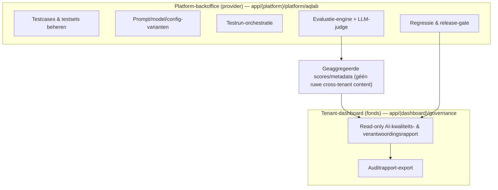
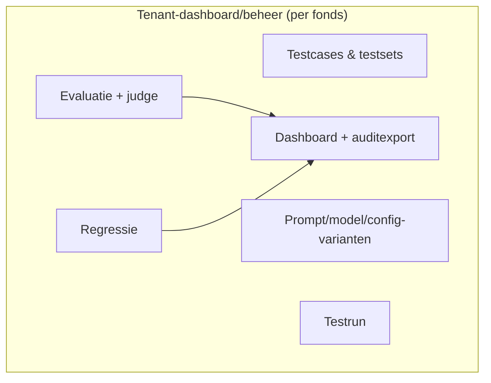
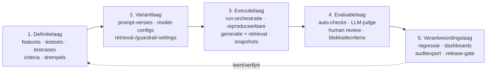
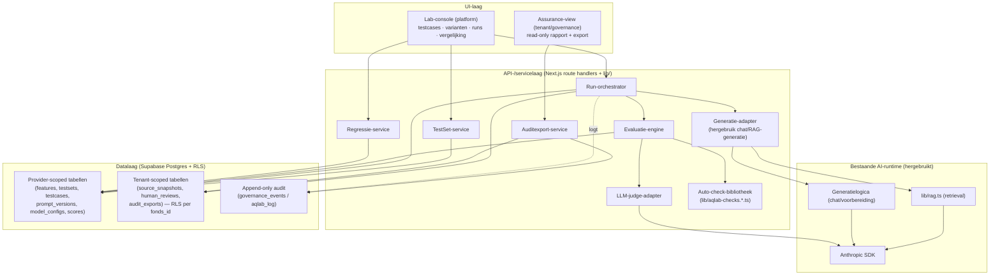
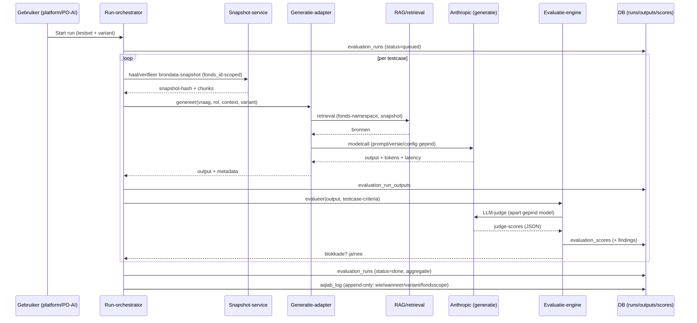
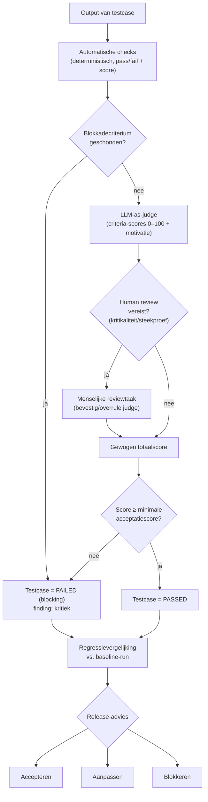
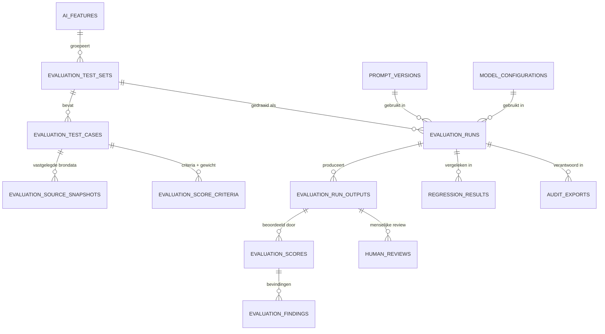

# AI Output Quality & Governance Lab — Architectuurontwerp

> **Status**: Concept v0.1 (ter review — géén implementatie)
> **Datum**: 2026-07-09
> **Auteur/rol**: Solution/Product Architect + AI-governance
> **Scope**: Architectuur (dit document) + Functioneel ontwerp + Technisch ontwerp (aparte docs)
> **Werknaam module**: *AI Output Quality & Governance Lab* (afgekort **AI Quality Lab**, code `aqlab`)
> **Verhouding tot bestaand werk**: bouwt voort op [`AI-GOVERNANCE-ONTWERP.md`](./AI-GOVERNANCE-ONTWERP.md), het bestaande evalprotocol [`evals/organisatieprofiel-gedrag.md`](./evals/organisatieprofiel-gedrag.md) + [`lib/organisatieprofiel.eval.sanity.ts`](./lib/organisatieprofiel.eval.sanity.ts), en de append-only auditlaag (`governance_events`, `governance_log`, `decision_ai_interactions`).

> **Leeswijzer feiten vs. keuzes.** In dit document markeer ik expliciet:
> **[FEIT]** — geverifieerd tegen codebase/migraties op 2026-07-09.
> **[ONTWERPKEUZE]** — voorstel dat wij kunnen aannemen of verwerpen.
> **[AANNAME]** — werkhypothese die validatie vereist.
> **[OPEN]** — openstaande vraag die inhoudelijk gevolg heeft.
> Bij twijfel wint de code (conform `CLAUDE.md`).

---

## 1. Doel en positionering

### 1.1 Waarom deze module bestaat

Het Bestuurdersportaal levert AI-ondersteuning bij bestuurlijk zware taken: samenvatting, besluitvoorbereiding, documentanalyse, brongebonden beantwoording, risicoanalyse, actielijsten en compliance-/WTP-duiding. Voor die context is "een prompt die werkt" onvoldoende. Een pensioenfondsbestuur, een auditor en een toezichthouder moeten kunnen zien dát AI-output brongebonden, herleidbaar, consistent en bestuurlijk bruikbaar is — en dat dit **structureel gemeten en aantoonbaar geborgd** is, niet incidenteel beoordeeld.

Vandaag gebeurt kwaliteitsborging van AI-output **ad hoc en per feature**. Het bestaande protocol `evals/organisatieprofiel-gedrag.md` is daarvan het beste voorbeeld: een vaste, herhaalbare evalset (E1 deterministische sanity-checks + E2 menselijke aftekening, model gepind, temperatuur 1.0, drempel 5/5) voor één AI-gedraging. **[FEIT]** Dat is precies de goede werkwijze — maar hij bestaat nu als losse markdown per feature, zonder databaseborging, zonder tenant-veilige opslag van testresultaten, zonder regressievergelijking over releases, en zonder rapportage die je aan bestuur of auditor toont.

Het AI Quality Lab **generaliseert en systematiseert** die werkwijze tot een herbruikbare, tenant-veilige, auditbare kwaliteits- en verantwoordingslaag over álle AI-features.

### 1.2 Positionering — beheersmaatregel, geen speeltuin

De module is een **beheersmaatregel binnen verantwoord AI-gebruik**, geen prompt-engineering-speeltuin. De waarde richting pensioenfondsen zit in vertrouwen, aantoonbaarheid, controle, compliance, auditability en bestuurlijke acceptatie. Concreet levert de module het bewijsmateriaal dat de vijf AI-governancefuncties uit `AI-GOVERNANCE-ONTWERP.md` §3 nodig hebben om go/no-go te geven:

| Governancefunctie (bestaand) | Wat het Lab levert |
| --- | --- |
| AI Governance Owner | Go/no-go-bewijs per release: kwaliteitsscores, regressiesignalen, openstaande reviews |
| AI Risk & Compliance Reviewer | Groundedness-, hallucination- en compliance-duidingscores + auditdossier per feature |
| Product Owner AI | Acceptatiecriteria per feature als machinaal toetsbare testcases |
| Technical AI & Security Owner | Herleidbaarheid prompt→model→config→bron→output; tenant-isolatie van testdata |
| AI Literacy & Adoption Lead | Uitlegbare kwaliteitsrapportage voor bestuur/bestuursbureau |

> **[ONTWERPKEUZE] Naam richting fonds.** Intern/technisch: *AI Quality & Governance Lab*. Richting bestuur/auditor adviseer ik een geruststellende, niet-technische naam op de assurance-view, bijv. **"AI-Kwaliteits- en Verantwoordingsrapport"**. "Lab" is prima voor de bouwende kant, minder voor een toezichtcontext.

### 1.3 Scope-afbakening (wat het Lab wél en niet is)

**Wel**: het systematisch definiëren, uitvoeren, scoren, vergelijken en verantwoorden van AI-output-kwaliteit over features, prompt-/modelversies en releases.

**Niet**: het live productiepad zelf. Het Lab draait AI-features *reproduceerbaar na* met gecontroleerde input; het vervangt niet de bestaande `governance_log`-logging van échte gebruikersinteracties. **[ONTWERPKEUZE]** Het Lab en de productie-runtime delen zoveel mogelijk dezelfde generatie- en retrieval-code (`lib/rag.ts`, de generatielogica achter `app/api/chat/route.ts`), zodat je test wat live draait — een expliciete les uit `evals/organisatieprofiel-gedrag.md` §1 (temp 1.0, exact `AI_MODEL`).

---

## 2. Plek binnen het totale Bestuurdersportaal

### 2.1 Bestaande architectuur (geverifieerd)

**[FEIT]** De relevante bestaande bouwstenen:

- **Stack**: Next.js 15 App Router + TypeScript strict, Tailwind, Supabase (Postgres + Auth + RLS), Anthropic SDK. Geen chart-library — visuals zijn pure SVG/HTML (`CLAUDE.md`).
- **Tenant-model**: strikte isolatie via **RLS per `fonds_id`**; uitsluitend anon-key + RLS, nooit de service-role-key in client-code. Tenant-tabel = `fondsen`, profielen = `profielen` (bevat rol + `fonds_id`).
- **AI-generatie**: `app/api/chat/route.ts` (streaming), retrieval in `lib/rag.ts` met fonds-namespacing ("fondsdiscipline", ADR 0045), embeddings/chunking/hybride zoek.
- **AI-logging**: `governance_log` (per AI-vraag: `gebruiker_id`, `fonds_id`, `vraag`, `antwoord`, `bronnen` jsonb, `modus`, `model`, `retrieval_meta` jsonb).
- **Human-validation workflow**: `decision_ai_interactions` (`prompt`, `bronnen`, `model`/`modelversie`, `output`, `validatiestatus` concept→gevalideerd→aangepast→afgekeurd→gearchiveerd, `gevalideerd_door`/`_op`, `validatie_domein`).
- **Append-only audit**: `governance_events` (sha256-hash/event, triggers blokkeren UPDATE/DELETE) en diverse `*_log`-tabellen met `fn_log_append_only`.
- **Config-/manifestlaag** (T8): `fonds_module_manifest`, `fonds_feature_flags`, `fonds_config_log` (append-only config-audit, ADR 0051), module-registry in code (`lib/module-registry.ts`, ADR 0050).
- **Twee UI-domeinen**: (a) tenant-`dashboard` (`app/(dashboard)/…` incl. `beheer/` en `governance/`); (b) **platform-backoffice** (`app/(platform)/platform/…`) — de cross-tenant provider-/leveranciersomgeving met eigen auth (`lib/platform-auth.ts`), `platform_event_log`, `platform_identities`, `platform_capabilities`.
- **Kwaliteitsinfrastructuur ontwikkeling**: `lib/*.sanity.ts` (`npm run sanity`), cross-tenant testsuite (`tests/cross-tenant/*`, `scripts/cross-tenant-ci.sh`), G2 go/no-go-gate (ADR 0049), ADR-log in `decisions/`.

### 2.2 Domeinkeuze: waar hoort het Lab? (jouw aanname kritisch getoetst)

Jouw werkaanname was: onderbrengen in het **beheer**-domein. Dat is verdedigbaar, maar er zit een principieel spanningsveld in dat ik expliciet wil maken, omdat het de tenant-isolatie en de rolverdeling raakt.

**Kernobservatie.** Het Lab bevat twee soorten activiteit met verschillende eigenaren:

1. **Productbrede engineering-/governancetaak (provider-kant).** Prompt-, model- en configvarianten definiëren en vergelijken, een golden testset onderhouden, regressie bewaken over releases. Dit is werk van het **product-/ontwikkelteam en de AI-governancefuncties** — niet van een individuele fondsbestuurder. Een bestuurder tuned geen system prompts.
2. **Fonds-/auditor-gerichte verantwoordingstaak (tenant-kant).** Een fonds, bestuursbureau of auditor wil kunnen zien dát de AI-output die zíj gebruiken kwalitatief geborgd is, en het bewijs (auditrapport) kunnen inzien/exporteren.

Daaruit volgen twee architectuuropties. **Beide zijn hieronder uitgewerkt (op jouw verzoek).** Mijn aanbeveling is Optie A.

#### Optie A — Platform-backoffice + read-only assurance-view in beheer (aanbevolen)

De **operationele module** (testcases beheren, runs starten, varianten vergelijken, scoren, regressie) leeft in de **platform-backoffice** (`app/(platform)/platform/…`), als provider-/leveranciersfunctie. In het tenant-**`beheer`/`governance`**-domein komt een **read-only "AI-Kwaliteits- en Verantwoordingsrapport"**: het fonds ziet de kwaliteitsscores en het auditdossier voor de features die het gebruikt, maar bewerkt geen prompts of testcases.

**Voordelen**: rolzuiver (prompt/model-governance is provider-werk); tenant-isolatie makkelijker te borgen (bewerkende functies zitten buiten het tenant-RLS-pad); sluit aan op de bestaande platform-backoffice en `platform_event_log`; het fonds krijgt vertrouwen zonder bewerkrechten die het niet hoort te hebben.
**Nadelen**: twee UI-plekken; de assurance-view moet zorgvuldig alleen geaggregeerde, tenant-eigen data tonen; vereist dat de platform-laag testbrondata van een fonds kan gebruiken zónder tenant-grenzen te schenden (zie §7 databeheersing).

#### Optie B — Volledig in het tenant-`beheer`-domein (jouw aanname)

Alles — inclusief testcases beheren en varianten vergelijken — leeft in `app/(dashboard)/beheer/…`, per fonds, onder het bestaande RLS-pad.

**Voordelen**: één UI-plek; alles automatisch tenant-geïsoleerd via bestaande RLS per `fonds_id`; conceptueel simpel; snelste MVP als er (nog) geen aparte productteam-omgeving nodig is.
**Nadelen (belangrijk, dit is de blinde vlek)**:
- **Rolverwarring/risico**: een fondsbeheerder krijgt de facto prompt-/model-engineeringrechten. Dat is bestuurlijk moeilijk uitlegbaar en vergroot het risico dat productbrede AI-configuratie per fonds gaat divergeren.
- **Geen productbrede regressie**: je kunt niet in één keer over álle fondsen zien of een nieuwe promptversie een verbetering of verslechtering is; regressie wordt per-fonds en versnipperd.
- **Golden set-probleem**: een fonds-eigen testset toetst alleen dat fonds; de *product*kwaliteit (die je aan een auditor wilt aantonen) blijft onbewezen op productniveau.
- **Duplicatie**: dezelfde testcase-logica moet per tenant worden onderhouden.

> **[ONTWERPKEUZE — aanbeveling]** Kies **Optie A**. Het datamodel is zo ontworpen dat Optie B een deelverzameling is: de tenant-scoped entiteiten (source-snapshots, human reviews, auditexports) krijgen `fonds_id` + RLS; de provider-scoped entiteiten (features, testsets, testcases, prompt-/modelvarianten, scores) zijn globaal/platform-scoped. Zo blijft Optie B mogelijk als tussenstap zonder het datamodel te breken. Zie het Technisch ontwerp §RLS.
>
> **[OPEN]** Bestaat er een organisatorisch onderscheid tussen "wij als productleverancier" en "het fonds als afnemer", of bouwen fondsen zelf mee aan prompts? Dat antwoord bepaalt definitief A vs B.

---

## 3. Conceptuele architectuur

Het Lab bestaat conceptueel uit vijf lagen:

1. **Definitielaag** — wat toetsen we? AI-features, testsets, testcases met verplichte onderdelen, beoordelingscriteria, minimale acceptatiescore, risico/kritikaliteit.
2. **Variantlaag** — waarmee toetsen we? Versies van prompt, system prompt, model, temperature, max tokens, retrieval-/chunking-settings, documentenset, guardrails/answer-templates.
3. **Executielaag** — reproduceerbaar uitvoeren. Een run neemt een testset × een variant, draait elke testcase via dezelfde generatie-/retrieval-code als productie, en legt input, context, output, bronnen, tokens, latency, kosten, fouten en een **brondata-snapshot** vast.
4. **Evaluatielaag** — scoren op vier manieren: automatische checks, LLM-as-judge, menselijke review, en harde blokkadecriteria voor kritieke fouten.
5. **Verantwoordingslaag** — regressievergelijking, dashboards, auditexport, en een release-advies (accepteren / aanpassen / blokkeren).

---

## 4. Logische componenten

**Kerncomponenten:**

- **Run-orchestrator** — neemt (testset, variant), itereert testcases, roept de generatie-adapter aan, verzamelt outputs, triggert de evaluatie-engine. Async/queue-gebaseerd (zie §performance in Technisch ontwerp).
- **Generatie-adapter** — dunne laag die de *bestaande* generatie- en retrievalcode aanroept met gecontroleerde parameters. **[ONTWERPKEUZE]** Kritiek principe: **niet** de generatielogica dupliceren; extraheren waar nodig zodat Lab en productie dezelfde code draaien. Dit vereist mogelijk een refactor die de generatiekern uit `app/api/chat/route.ts` losmaakt (zie risico R4).
- **Evaluatie-engine** — orkestreert per output: automatische checks → LLM-judge → (optioneel) human review-taak → blokkadecriteria; aggregeert tot een gewogen totaalscore.
- **Auto-check-bibliotheek** — pure, deterministische functies (patroon: `lib/*.sanity.ts`), bv. format-compliance, verplichte onderdelen aanwezig, bron-marker-aanwezigheid, herkomstlabel-scheiding (`[Bron N]` vs `[Algemene kennis]` vs `[Organisatieprofiel]`).
- **LLM-judge-adapter** — gestructureerde beoordeling met vast judge-prompt en JSON-output-schema; apart gepind model.
- **Regressie-service** — vergelijkt runs (nieuw vs baseline) per testcase en aggregeert een regressiesignaal + release-advies.
- **Auditexport-service** — genereert een onveranderlijk, herleidbaar auditdossier (hergebruik van het patroon in `lib/auditdossier-html.ts` / `AuditExportKnop`).

---

## 5. Datastromen

### 5.1 Flow van een testrun

### 5.2 Evaluatie- en regressieproces

### 5.3 Datamodel op hoofdlijnen

---

## 6. Integratie met bestaande functies

### 6.1 AI-functies en RAG/retrieval

**[ONTWERPKEUZE]** De generatie-adapter hergebruikt `lib/rag.ts` (retrieval met fondsdiscipline-namespacing) en de generatiekern achter `app/api/chat/route.ts`. Voordeel: je test wat live draait; de herkomstlabel-invarianten (`[Bron N]`, `[Algemene kennis]`, `[Volgens wetgeving]`, `[Organisatieprofiel]`, `[Toelichting agendapunt]`) en `retrieval_meta` komen "gratis" mee en zijn direct als auto-check bruikbaar. **[FEIT]** die labels/meta bestaan al (ADR 0027/0028, AI-GOVERNANCE-ONTWERP §5).

**[AANNAME]** De generatielogica is momenteel deels verweven met de HTTP-route (streaming) in `app/api/chat/route.ts` (1536 regels). Om ze headless te kunnen aanroepen vanuit een run, is waarschijnlijk een lichte extractie nodig van een pure `genereerAntwoord(params)`-kern. **[OPEN]** hoeveel van de route is herbruikbaar zonder refactor? Te verifiëren vóór MVP-bouw.

### 6.2 Documentopslag / retrieval / snapshots

Testcases verwijzen naar brondocumenten. Omdat documenten en hun indexering wijzigen (reindex, nieuwe versies), moet een run een **snapshot** vastleggen zodat een historische run reproduceerbaar en verklaarbaar blijft — dit sluit aan op het bestaande **snapshot-bij-start**-principe voor procedures (`CLAUDE.md`, niet-onderhandelbare guardrail). **[ONTWERPKEUZE]** Een snapshot is minimaal een set document-/chunk-ID's + inhouds-hashes + het effectief toegepaste retrievalfilter (`retrieval_meta`-vorm), niet noodzakelijk een kopie van alle content (zie §7 en Technisch ontwerp).

### 6.3 Logging / audittrail

**[ONTWERPKEUZE]** Hergebruik het bestaande append-only patroon. Twee opties:
- (a) elk Lab-relevant event ook in `governance_events` (met `object_type='aqlab_run'` e.d.), of
- (b) een eigen `aqlab_log`-tabel met `fn_log_append_only`, analoog aan `fonds_config_log` (ADR 0051).

**Aanbeveling**: **(b)** een eigen append-only `aqlab_log`, om `governance_events` (dat aan `decision_id` hangt) niet te overladen met niet-besluitgebonden events. Zelfde onveranderlijkheidsgaranties, aparte semantiek.

---

## 7. Tenant- en autorisatiemodel + databeheersing

Dit is het scharnierpunt van het ontwerp en verdient scherpte, want hier zit het grootste risico.

### 7.1 Scheiding provider-scoped vs tenant-scoped

**[ONTWERPKEUZE]** Twee klassen data:

- **Provider-scoped (globaal, geen `fonds_id`)**: `ai_features`, `evaluation_test_sets`*, `evaluation_test_cases`*, `evaluation_score_criteria`, `prompt_versions`, `model_configurations`, en de geaggregeerde `evaluation_scores`/`regression_results` op productniveau. Beheerd via de platform-backoffice; toegang via `platform_identity_capabilities` (bestaand patroon), niet via tenant-RLS.
- **Tenant-scoped (`fonds_id` + RLS)**: `evaluation_source_snapshots` (bevat verwijzingen naar/derivaten van échte fondsdocumenten), `human_reviews` door fondsgebruikers, `audit_exports` per fonds.

(*) `evaluation_test_sets`/`test_cases` kunnen **beide** zijn: een **golden set** (provider, synthetisch/geanonimiseerd) én optioneel **fonds-eigen** sets. **[ONTWERPKEUZE]** Voeg daarom aan test_sets een `scope`-kolom toe (`global` | `fonds`) + nullable `fonds_id`; bij `scope='fonds'` geldt RLS.

### 7.2 Niet-onderhandelbare databeheersing

- **Testbrondata mag nooit ongemerkt tenantgrenzen overschrijden.** Een provider-scoped golden set gebruikt **synthetische of geanonimiseerde** brondata (fictief demofonds *Horizon*, `CLAUDE.md`). Echte fondsdata blijft in fonds-scoped snapshots met RLS.
- **Cross-tenant aggregatie = alléén scores/metadata, nooit ruwe content.** De productbrede dashboards (Optie A) tonen geaggregeerde scores; ze mogen geen fonds-specifieke bron- of outputtekst over tenantgrenzen tonen.
- **RLS met `WITH CHECK` op elke tenant-schrijfpolicy** (verplicht sinds T3, `T3-RLS-CONTROLEKADER.md`). De structurele test `2026_07_08_t3_cross_tenant.sql` faalt anders.
- **Geen service-role-key in client-code.** De run-orchestrator draait server-side; waar hij fonds-data leest, doet hij dat onder de juiste RLS-context, niet met een omzeiling. **[OPEN]** de platform-laag heeft mogelijk service-role-achtige toegang nodig om fonds-snapshots te maken — dit moet expliciet, geregistreerd en append-only gelogd (analoog aan de service-role-inventaris in T3). Te ontwerpen met de Technical & Security Owner.

### 7.3 Autorisatie

| Actie | Optie A (aanbevolen) | Optie B |
| --- | --- | --- |
| Testcases/varianten beheren, runs starten | `platform_identity_capabilities` (bv. `aqlab:beheer`) | fonds-rol `beheerder` in `beheer` |
| Kwaliteitsrapport inzien | fonds: alle bestuurders (read-only) | idem |
| Human review uitvoeren | reviewer-capability / fondsrol met `validatie_domein`-match | fondsrol met `validatie_domein`-match |
| Auditexport | fonds-beheerder + platform | fonds-beheerder |

**[ONTWERPKEUZE]** Hergebruik de bestaande `validatie_domein`-logica uit `decision_ai_interactions` (`algemeen`/`risk`/`compliance`/`beleggingen`/`governance`) om te bepalen wie een human review voor een bepaalde testcase mag aftekenen.

---

## 8. Afhankelijkheden

- **Anthropic SDK** — generatie én LLM-judge. **[ONTWERPKEUZE]** judge en te-toetsen-feature draaien op apart gepinde modellen; judge-model expliciet vastleggen (self-grading-bias vermijden).
- **Supabase Postgres + RLS** — opslag; append-only triggers (`fn_log_append_only`, `fn_govevent_*`).
- **Bestaande generatie-/retrievalcode** — `lib/rag.ts`, generatiekern chat/voorbereiding (extractie nodig, R4).
- **Platform-backoffice + auth** — `lib/platform-auth.ts`, `platform_identity_capabilities` (Optie A).
- **Async-uitvoering** — een queue/worker of Vercel-achtige achtergrondverwerking. **[OPEN]** huidige deploy is Vercel; runs kunnen lang duren (N testcases × modelcalls). Mechanisme voor achtergrond-jobs te bepalen (bestaat `document_processing_jobs` al als patroon? **[FEIT]** die tabel bestaat — mogelijk herbruikbaar model).
- **Kostenbewaking** — tokentelling per run (Anthropic geeft usage terug).

---

## 9. Belangrijkste ontwerpkeuzes (samenvatting)

1. **[ONTWERPKEUZE]** Positioneer als beheersmaatregel/verantwoordingslaag, niet als prompt-lab.
2. **[ONTWERPKEUZE]** Optie A: operationele module in platform-backoffice, read-only assurance-view in tenant-`governance`/`beheer`. Datamodel houdt Optie B open.
3. **[ONTWERPKEUZE]** Hergebruik bestaande generatie-/retrievalcode (test wat live draait) i.p.v. dupliceren.
4. **[ONTWERPKEUZE]** Vier evaluatiemodi: automatische checks, LLM-as-judge, human review, harde blokkadecriteria.
5. **[ONTWERPKEUZE]** Strikte scheiding provider-scoped (globaal) vs tenant-scoped (`fonds_id`+RLS); cross-tenant alleen scores/metadata.
6. **[ONTWERPKEUZE]** Snapshot-bij-run voor reproduceerbaarheid, conform bestaand snapshot-principe.
7. **[ONTWERPKEUZE]** Eigen append-only `aqlab_log` (patroon `fonds_config_log`), niet `governance_events` overladen.
8. **[ONTWERPKEUZE]** Golden set synthetisch/geanonimiseerd op productniveau; fonds-eigen sets optioneel via `scope`.

---

## 10. Risico's en beheersmaatregelen

| # | Risico | Impact | Beheersmaatregel |
| --- | --- | --- | --- |
| R1 | Testbrondata lekt over tenantgrenzen (aggregatie/snapshots) | Zeer hoog (RLS-breuk, vertrouwensverlies) | Provider-scoped = synthetisch; tenant-scoped = RLS+`WITH CHECK`; cross-tenant enkel scores; cross-tenant testsuite uitbreiden met AQLab-cases |
| R2 | LLM-judge is onbetrouwbaar/bevooroordeeld (self-grading, inconsistentie) | Hoog (valse zekerheid) | Judge apart gepind model; judge kalibreren tegen human review; blokkadecriteria deterministisch (niet via judge); judge-scores altijd naast auto-checks tonen |
| R3 | "Meten = weten"-schijnzekerheid richting bestuur | Hoog (bestuurlijk) | Rapport toont expliciet marges/onzekerheid, steekproefkarakter, en dat scores geen juridische garantie zijn; geen harde compliance-claims (`CLAUDE.md` "geen schijnzekerheid") |
| R4 | Generatiekern niet headless aanroepbaar zonder refactor | Middel (scope/tijd) | Vroeg spike: extraheer `genereerAntwoord()` uit chat-route; MVP desnoods met dunne herimplementatie mits identiek gepind |
| R5 | Runs te traag/duur (N×modelcalls × varianten) | Middel | Async jobs, batching, caching van retrieval, kostenplafond per run, MVP beperkt tot 20–30 testcases |
| R6 | Divergentie prompt/config per fonds (bij Optie B) | Middel | Optie A; of centrale golden set als productbrede baseline |
| R7 | Testset veroudert (drift t.o.v. echte vragen) | Middel | Periodieke herijking; kandidaat-testcases afleiden uit `governance_log` (geanonimiseerd) |
| R8 | Append-only/immutability per ongeluk omzeild | Hoog (audit) | Hergebruik bestaande triggers; opnemen in T3-controlekader |

---

## 11. MVP versus groeipad

| Laag | MVP (nu) | Uitbreiding (later) | Strategische eindplaat |
| --- | --- | --- | --- |
| Definitie | 20–30 vaste testcases, 1–3 features | Testcases per alle features; fonds-eigen sets | Zelfbedienings-testcasebeheer, versiebeheer testsets |
| Varianten | Prompt-versie + modelconfig vergelijken | Retrieval-/chunking-varianten, guardrails | Volledige config-matrix + A/B in productie |
| Executie | Single feature test, async | Full-funnel test (keten van features) | Continue/geplande runs |
| Evaluatie | Auto-checks + LLM-judge + lichte human review | Kalibratie judge↔mens, source recall/precision | Zelflerende criteria, drift-detectie |
| Regressie | Overzicht vs. vorige run, min-score, advies | Baseline-branching, per-versie-trend | Blokkerende release-gate in CI/CD |
| Rapportage | Basisdashboard per feature | Model-/kostenvergelijking, reviewqueue | Auditor-portaal, periodieke assurance-rapporten |
| Governance | Handmatige go/no-go, auditexport basis | Change-control-koppeling, herbeoordelingscyclus | AI-Act-verantwoordingsdossier geïntegreerd |

**Expliciet niet in MVP** (conform je brief): volledig geautomatiseerde CI/CD-blokkade, uitgebreide kostenoptimalisatie, complexe multi-model-orchestration, geavanceerde source recall-analyse, uitgebreide auditor-export, volledig workflowmanagement.

---

## 12. Openstaande vragen (architectuur)

1. **[OPEN]** Provider vs fonds: bouwen fondsen zelf mee aan prompts? → beslist A vs B definitief.
2. **[OPEN]** Herbruikbaarheid generatiekern uit `app/api/chat/route.ts` zonder refactor (R4).
3. **[OPEN]** Mechanisme voor achtergrond-jobs op Vercel (hergebruik `document_processing_jobs`-patroon?).
4. **[OPEN]** Mag/kan de platform-laag fonds-snapshots maken, en zo ja onder welke expliciete, gelogde privileged toegang (service-role-inventaris)?
5. **[OPEN]** Naamgeving entiteiten: repo-conventie is **Nederlands** snake_case; jij specificeerde **Engelse** entiteitsnamen. Consistentie kiezen (zie Technisch ontwerp §naamgeving).
6. **[OPEN]** Formele EU AI Act-classificatie (provider vs deployer) — juridische input nodig; het Lab levert het bewijs, niet het juridisch oordeel.

---

*Vervolg: zie `AI-QUALITY-LAB-FUNCTIONEEL.md` (schermen, journeys, workflows) en `AI-QUALITY-LAB-TECHNISCH.md` (datamodel, API, engine, RLS, teststrategie).*
