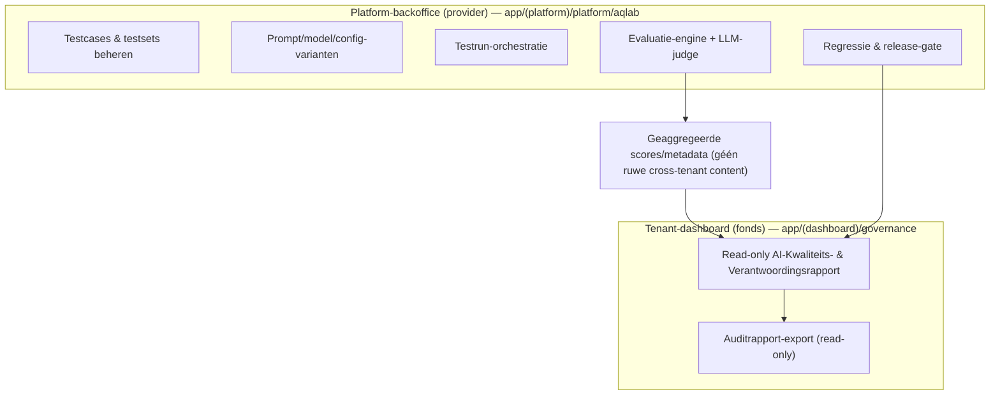
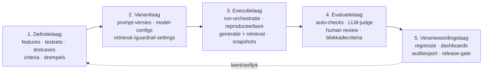
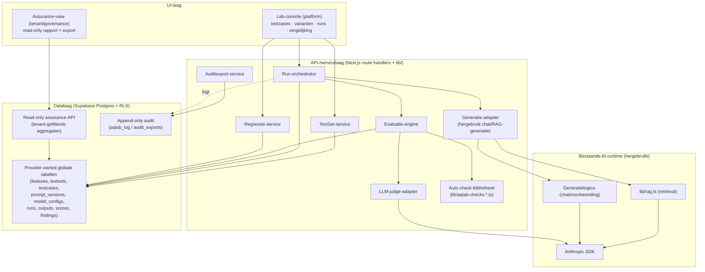
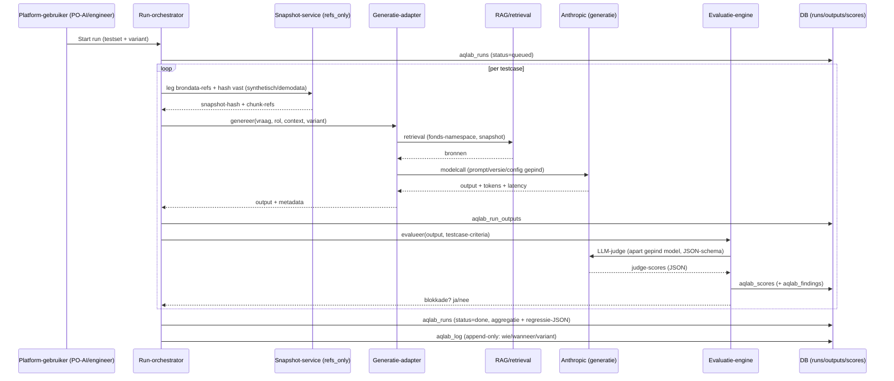
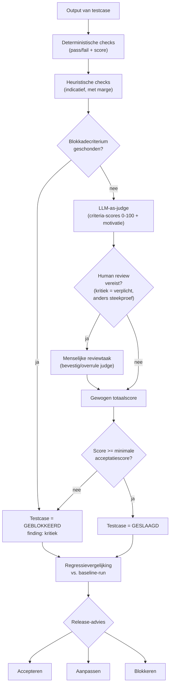
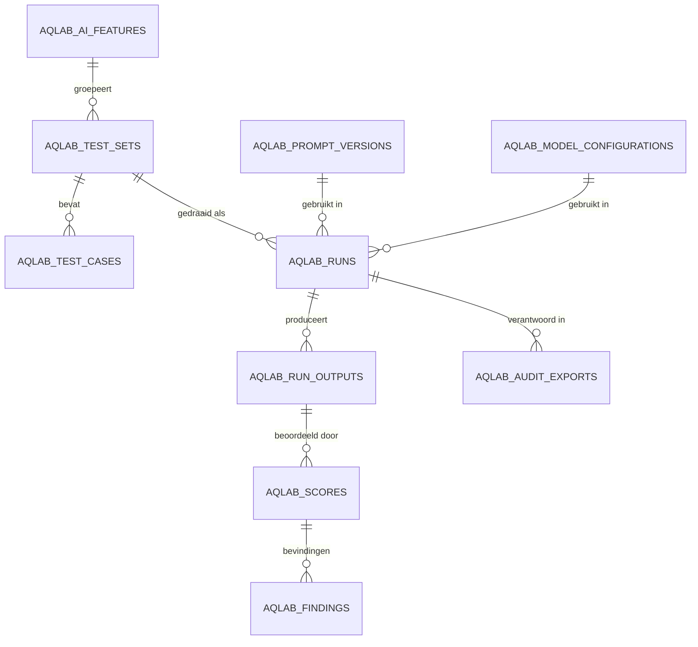

# AI Output Quality & Governance Lab — Architectuurontwerp

> **Status**: Concept **v0.3** (ter review — géén implementatie)
> **Datum**: 2026-07-10
> **Auteur/rol**: Solution/Product Architect + AI-governance
> **Scope**: Architectuur (dit document) + Functioneel ontwerp + Technisch ontwerp (aparte docs) + Bestuurssamenvatting (docx) + eerste regressieset (AQLAB-MVP-REGRESSIESET-v0.1)
> **Werknaam module**: *AI Output Quality & Governance Lab* (afgekort **AI Quality Lab**, code `aqlab`)
> **Verhouding tot bestaand werk**: bouwt voort op [`AI-GOVERNANCE-ONTWERP.md`](./AI-GOVERNANCE-ONTWERP.md), het bestaande evalprotocol [`evals/organisatieprofiel-gedrag.md`](./evals/organisatieprofiel-gedrag.md) + [`lib/organisatieprofiel.eval.sanity.ts`](./lib/organisatieprofiel.eval.sanity.ts), en de append-only auditlaag (`governance_events`, `governance_log`, `decision_ai_interactions`).

> **Wijziging t.o.v. v0.2 (kort).** Expliciet onderscheid tussen **productbrede assurance** (MVP: toetsing van AI-feature/prompt/model op synthetische testsets) en **fonds-specifieke assurance** (later: toetsing op echte fondsdocumenten) — §1.4. Datamodel-hoofdlijnen uitgebreid met **`aqlab_release_decisions`** (bron van waarheid voor vrijgave) en **`aqlab_fixture_documents`** (synthetische golden data) — §5.3. Volledige wijzigingenlijst in §14 (t.o.v. v0.2).

> **Wijziging t.o.v. v0.1 (kort).** Optie A is de vastgelegde voorkeursarchitectuur i.p.v. één van twee gelijkwaardige opties. Fondsen beheren in de MVP geen prompts, modelconfiguraties, productbrede testsets of regressieruns; zij krijgen uitsluitend een read-only AI-Kwaliteits- en Verantwoordingsrapport. Toegevoegd in v0.2: *Te nemen besluiten vóór bouw* (§9), aangescherpte MVP-afbakening (§12), consequenties voor autorisatie/datamodel/UI/audit/support (§2.3).

> **Leeswijzer feiten vs. keuzes.** In dit document markeer ik expliciet:
> **[FEIT]** — geverifieerd tegen codebase/migraties op 2026-07-09.
> **[ONTWERPKEUZE]** — voorstel dat wij kunnen aannemen of verwerpen.
> **[AANNAME]** — werkhypothese die validatie vereist.
> **[OPEN]** — openstaande vraag die inhoudelijk gevolg heeft.
> Bij twijfel wint de code (conform `CLAUDE.md`).

---

## 1. Doel en positionering

### 1.1 Waarom deze module bestaat

Het Bestuurdersportaal levert AI-ondersteuning bij bestuurlijk zware taken: samenvatting, besluitvoorbereiding, documentanalyse, brongebonden beantwoording, risicoanalyse, actielijsten en compliance-/WTP-duiding. Voor die context is "een prompt die werkt" onvoldoende. Een pensioenfondsbestuur, een auditor en een toezichthouder moeten kunnen zien dát AI-output brongebonden, herleidbaar, consistent en bestuurlijk bruikbaar is — en dat dit **structureel gemeten en aantoonbaar geborgd** is, niet incidenteel beoordeeld.

Vandaag gebeurt kwaliteitsborging van AI-output **ad hoc en per feature**. Het bestaande protocol `evals/organisatieprofiel-gedrag.md` is daarvan het beste voorbeeld: een vaste, herhaalbare evalset (E1 deterministische sanity-checks + E2 menselijke aftekening, model gepind, temperatuur 1.0, drempel 5/5) voor één AI-gedraging. **[FEIT]** Dat is precies de goede werkwijze — maar hij bestaat nu als losse markdown per feature, zonder databaseborging, zonder tenant-veilige opslag van testresultaten, zonder regressievergelijking over releases, en zonder rapportage die je aan bestuur of auditor toont.

Het AI Quality Lab **generaliseert en systematiseert** die werkwijze tot een herbruikbare, tenant-veilige, auditbare kwaliteits- en verantwoordingslaag over álle AI-features.

### 1.2 Positionering — beheersmaatregel, geen speeltuin

De module is een **beheersmaatregel binnen verantwoord AI-gebruik**, geen prompt-engineering-speeltuin. De waarde richting pensioenfondsen zit in vertrouwen, aantoonbaarheid, controle, compliance, auditability en bestuurlijke acceptatie. Concreet levert de module het bewijsmateriaal dat de vijf AI-governancefuncties uit `AI-GOVERNANCE-ONTWERP.md` §3 nodig hebben om go/no-go te geven:

| Governancefunctie (bestaand) | Wat het Lab levert |
| --- | --- |
| AI Governance Owner | Go/no-go-bewijs per release: kwaliteitsscores, regressiesignalen, openstaande reviews |
| AI Risk & Compliance Reviewer | Groundedness-, hallucination- en compliance-duidingscores + auditdossier per feature |
| Product Owner AI | Acceptatiecriteria per feature als machinaal toetsbare testcases |
| Technical AI & Security Owner | Herleidbaarheid prompt→model→config→bron→output; tenant-isolatie van testdata |
| AI Literacy & Adoption Lead | Uitlegbare kwaliteitsrapportage voor bestuur/bestuursbureau |

> **[ONTWERPKEUZE] Naam richting fonds.** Intern/technisch: *AI Quality & Governance Lab*. Richting bestuur/auditor gebruiken we op de assurance-view de niet-technische naam **"AI-Kwaliteits- en Verantwoordingsrapport"**. "Lab" is voor de bouwende kant; niet voor de toezichtcontext.

### 1.3 Scope-afbakening (wat het Lab wél en niet is)

**Wel**: het systematisch definiëren, uitvoeren, scoren, vergelijken en verantwoorden van AI-output-kwaliteit over features, prompt-/modelversies en releases.

**Niet**: het live productiepad zelf. Het Lab draait AI-features *reproduceerbaar na* met gecontroleerde input; het vervangt niet de bestaande `governance_log`-logging van échte gebruikersinteracties. **[ONTWERPKEUZE]** Het Lab en de productie-runtime delen zoveel mogelijk dezelfde generatie- en retrieval-code (`lib/rag.ts`, de generatielogica achter `app/api/chat/route.ts`), zodat je test wat live draait — een expliciete les uit `evals/organisatieprofiel-gedrag.md` §1 (temp 1.0, exact `AI_MODEL`).

### 1.4 Productbrede vs fonds-specifieke assurance (scope van de MVP)

**[ONTWERPKEUZE]** Omdat de MVP volledig op provider-owned **synthetische** golden data draait (zie §7), toetst de MVP **productbrede AI-featurekwaliteit** — niet de kwaliteit van AI-output op echte fondsdocumenten. Dit onderscheid is bewust en bepaalt scope, datamodel en rapportage.

| | **Product-assurance** (MVP) | **Fonds-specifieke assurance** (later) |
| --- | --- | --- |
| Toetst | AI-feature, prompt, modelconfiguratie, uitvoergedrag | Kwaliteit op echte fondsdocumenten / fonds-eigen testsets |
| Testdata | Synthetisch/representatief (demofonds *Horizon*) | Echte fondsdocumenten (fonds-scoped) |
| Rol | Onderdeel van productrelease + regressiecontrole | Aanvullende fondsvalidatie |
| Datamodel | Provider-owned globaal, geen `fonds_id` | `fonds_id NOT NULL` + RLS + `WITH CHECK` + retentiebeleid |
| Scope | **In MVP** | **Niet in MVP — latere uitbreiding** |

De assurance-view labelt elk rapport expliciet als *productbrede controle* en voegt toe dat de controle op representatieve testgevallen is uitgevoerd en niet bewijst dat elk fondsdocument inhoudelijk is gevalideerd (Functioneel §5.0; Technisch §1.5). Zo ondersteunt het rapport kwaliteitsborging zonder een inhoudelijke of juridische garantie op alle fondsoutput te suggereren.

---

## 2. Plek binnen het totale Bestuurdersportaal

### 2.1 Bestaande architectuur (geverifieerd)

**[FEIT]** De relevante bestaande bouwstenen:

- **Stack**: Next.js 15 App Router + TypeScript strict, Tailwind, Supabase (Postgres + Auth + RLS), Anthropic SDK. Geen chart-library — visuals zijn pure SVG/HTML (`CLAUDE.md`).
- **Tenant-model**: strikte isolatie via **RLS per `fonds_id`**; uitsluitend anon-key + RLS, nooit de service-role-key in client-code. Tenant-tabel = `fondsen`, profielen = `profielen` (bevat rol + `fonds_id`).
- **AI-generatie**: `app/api/chat/route.ts` (streaming), retrieval in `lib/rag.ts` met fonds-namespacing ("fondsdiscipline", ADR 0045), embeddings/chunking/hybride zoek.
- **AI-logging**: `governance_log` (per AI-vraag: `gebruiker_id`, `fonds_id`, `vraag`, `antwoord`, `bronnen` jsonb, `modus`, `model`, `retrieval_meta` jsonb).
- **Human-validation workflow**: `decision_ai_interactions` (`prompt`, `bronnen`, `model`/`modelversie`, `output`, `validatiestatus` concept→gevalideerd→aangepast→afgekeurd→gearchiveerd, `gevalideerd_door`/`_op`, `validatie_domein`).
- **Append-only audit**: `governance_events` (sha256-hash/event, triggers blokkeren UPDATE/DELETE) en diverse `*_log`-tabellen met `fn_log_append_only`.
- **Config-/manifestlaag** (T8): `fonds_module_manifest`, `fonds_feature_flags`, `fonds_config_log` (append-only config-audit, ADR 0051), module-registry in code (`lib/module-registry.ts`, ADR 0050).
- **Twee UI-domeinen**: (a) tenant-`dashboard` (`app/(dashboard)/…` incl. `beheer/` en `governance/`); (b) **platform-backoffice** (`app/(platform)/platform/…`) — de cross-tenant provider-/leveranciersomgeving met eigen auth (`lib/platform-auth.ts`), `platform_event_log`, `platform_identities`, `platform_capabilities`.
- **Kwaliteitsinfrastructuur ontwikkeling**: `lib/*.sanity.ts` (`npm run sanity`), cross-tenant testsuite (`tests/cross-tenant/*`, `scripts/cross-tenant-ci.sh`), G2 go/no-go-gate (ADR 0049), ADR-log in `decisions/`.

### 2.2 Domeinkeuze: Optie A is de voorkeursarchitectuur

De eerdere werkaanname was: onderbrengen in het **beheer**-domein per fonds. Na review is de richting nu **vastgelegd**: de operationele Lab-functionaliteit hoort in de **platform-backoffice**; het fonds krijgt in het tenant-domein uitsluitend een **read-only rapport**. Onderstaand de onderbouwing, gevolgd door de expliciete keuze en de afgewezen variant.

**Kernobservatie.** Het Lab bevat twee soorten activiteit met verschillende eigenaren:

1. **Productbrede engineering-/governancetaak (provider-kant).** Prompt-, model- en configvarianten definiëren en vergelijken, een golden testset onderhouden, regressie bewaken over releases. Dit is werk van het **product-/ontwikkelteam en de AI-governancefuncties** — niet van een individuele fondsbestuurder. Een bestuurder tuned geen system prompts.
2. **Fonds-/auditor-gerichte verantwoordingstaak (tenant-kant).** Een fonds, bestuursbureau of auditor wil kunnen zien dát de AI-output die zíj gebruiken kwalitatief geborgd is, en het bewijs (auditrapport) kunnen inzien/exporteren.

#### Optie A — Platform-backoffice + read-only assurance-view (VOORKEUR, vastgelegd)

De **operationele module** (testcases beheren, runs starten, varianten vergelijken, scoren, regressie) leeft in de **platform-backoffice** (`app/(platform)/platform/aqlab`), als provider-/leveranciersfunctie. In het tenant-**`governance`**-domein komt een **read-only "AI-Kwaliteits- en Verantwoordingsrapport"**: het fonds ziet de kwaliteitsscores en het auditdossier voor de features die het gebruikt, maar bewerkt niets.

**Waarom dit de voorkeur is:**

- **Rolzuiver**: prompt-/model-governance is provider-werk; een fondsbeheerder krijgt geen de-facto prompt-engineeringrechten.
- **Productbrede regressie mogelijk**: je ziet in één keer of een nieuwe promptversie een verbetering of verslechtering is — niet versnipperd per fonds.
- **Eenvoudiger tenant-isolatie**: bewerkende functies zitten buiten het tenant-RLS-pad; de golden set is synthetisch/gedemonstreerd, dus er staat geen ruwe fondscontent in de provider-tabellen (zie §7 en Technisch ontwerp).
- **Sluit aan op bestaande bouwstenen**: platform-backoffice, `platform_identity_capabilities`, `platform_event_log`.

#### Optie B — Volledig in het tenant-`beheer`-domein (AFGEWEZEN voor MVP)

Alles — inclusief testcases beheren en varianten vergelijken — per fonds onder het bestaande RLS-pad. **Afgewezen** omdat het (a) fondsbeheerders de facto prompt-/model-engineeringrechten geeft, (b) productbrede regressie onmogelijk maakt, (c) de productkwaliteit die je aan een auditor wilt aantonen onbewezen laat op productniveau, en (d) testcase-logica per tenant dupliceert.

> **[ONTWERPKEUZE — vastgelegd] Optie A.** In de MVP beheren fondsen **geen** prompts, modelconfiguraties, productbrede testsets of regressieruns. **Fonds-specifieke validatie of fonds-eigen testsets zijn een expliciete latere uitbreiding, geen MVP-onderdeel.** Het datamodel wordt hierop vereenvoudigd (geen onnodige nullable `fonds_id`; zie Technisch ontwerp §1).

### 2.3 Consequenties van Optie A (autorisatie · datamodel · UI · audit · support)

Deze keuze werkt door in vijf lagen. Dit expliciet maken voorkomt latere verrassingen.

| Laag | Consequentie van Optie A in de MVP |
| --- | --- |
| **Autorisatie** | Bewerken (testsets, testcases, prompts, modelconfigs, runs starten, regressie) uitsluitend via `platform_identity_capabilities` (`aqlab:beheer`/`aqlab:review`/`aqlab:govern`). Fondsrollen krijgen **uitsluitend leesrecht** op de assurance-view; geen enkele fondsrol kan Lab-objecten muteren. Human review in de MVP wordt door de **provider-reviewer** (AI Risk & Compliance Reviewer) gedaan, niet door fondsgebruikers. |
| **Datamodel** | De Lab-tabellen zijn **provider-owned globaal** (geen `fonds_id`) en bevatten synthetische/demodata. Er is in de MVP **geen** tabel met ruwe fondscontent, dus geen nullable-`fonds_id`-constructies die de security compliceren. Fonds-scoped tabellen (fonds-eigen snapshots/reviews/testsets) worden pas geïntroduceerd bij de latere uitbreiding, mét `fonds_id NOT NULL` + RLS + `WITH CHECK`. |
| **UI** | Twee plekken: (1) platform-console voor het team; (2) één read-only assurance-scherm in `governance` voor het fonds. De assurance-view toont **alleen metrics en het auditrapport**, nooit ruwe output of prompts. |
| **Audit** | Alle Lab-acties → append-only `aqlab_log`. De read-only export die het fonds downloadt is onveranderlijk (hash) en append-only vastgelegd. Besluiten (go/no-go) worden append-only gelogd. |
| **Support** | Vragen over prompts/modelkeuze/regressie gaan naar het **provider-team** (single point of governance), niet naar een fondsbeheerder. Het fonds heeft één supportvraag: "wat betekent dit rapport?" — beantwoord door de assurance-view zelf (uitleg per metric) en de AI Literacy Lead. |

---

## 3. Conceptuele architectuur

Het Lab bestaat conceptueel uit vijf lagen:

1. **Definitielaag** — wat toetsen we? AI-features, testsets, testcases met verplichte onderdelen, beoordelingscriteria, minimale acceptatiescore, risico/kritikaliteit.
2. **Variantlaag** — waarmee toetsen we? Versies van prompt, system prompt, model, temperature, max tokens, retrieval-/chunking-settings, documentenset, guardrails/answer-templates. In de MVP: **één baseline vs één challenger**.
3. **Executielaag** — reproduceerbaar uitvoeren. Een run neemt een testset × een variant, draait elke testcase via dezelfde generatie-/retrieval-code als productie, en legt input, context, output, bronnen, tokens, latency, kosten, fouten en een **brondata-snapshot (refs_only)** vast.
4. **Evaluatielaag** — scoren op vijf manieren (Functioneel §4): deterministische checks, heuristische checks, LLM-as-judge, menselijke review, en harde blokkadecriteria voor kritieke fouten.
5. **Verantwoordingslaag** — regressievergelijking, dashboards, auditexport, en een release-advies (accepteren / aanpassen / blokkeren).

---

## 4. Logische componenten

**Kerncomponenten:**

- **Run-orchestrator** — neemt (testset, variant), itereert testcases, roept de generatie-adapter aan, verzamelt outputs, triggert de evaluatie-engine. Async/job-gebaseerd (zie Technisch ontwerp §Spikes).
- **Generatie-adapter** — dunne laag die de *bestaande* generatie- en retrievalcode aanroept met gecontroleerde parameters. **[ONTWERPKEUZE]** Kritiek principe: **niet** de generatielogica dupliceren; extraheren zodat Lab en productie dezelfde code draaien. Vereist het losmaken van de generatiekern uit `app/api/chat/route.ts` — dit is een **pre-implementation spike** (R4, Technisch ontwerp §Spikes).
- **Evaluatie-engine** — orkestreert per output: deterministische/heuristische checks → LLM-judge → (optioneel) human review-taak → blokkadecriteria; aggregeert tot een gewogen totaalscore.
- **Auto-check-bibliotheek** — pure, deterministische functies (patroon: `lib/*.sanity.ts`), bv. format-compliance, verplichte onderdelen aanwezig, bron-marker-aanwezigheid, herkomstlabel-scheiding (`[Bron N]` vs `[Algemene kennis]` vs `[Organisatieprofiel]`).
- **LLM-judge-adapter** — gestructureerde beoordeling met vast judge-prompt en **vast JSON-output-schema**; apart gepind model.
- **Regressie-service** — vergelijkt runs (challenger vs baseline) per testcase en aggregeert een regressiesignaal + release-advies.
- **Auditexport-service** — genereert een onveranderlijk, herleidbaar auditdossier (hergebruik van het patroon in `lib/auditdossier-html.ts` / `AuditExportKnop`).

---

## 5. Datastromen

### 5.1 Flow van een testrun

### 5.2 Evaluatie- en regressieproces

### 5.3 Datamodel op hoofdlijnen (MVP)

> De MVP-tabellenset is bewust minimaal (zie Technisch ontwerp §1). Twee entiteiten zijn in v0.3 toegevoegd: **`aqlab_release_decisions`** (de append-only bron van waarheid voor vrijgave — welke run/prompt/model officieel is vrijgegeven, door wie, met welk auditrapport; kritieke bevinding blokkeert vrijgave) en **`aqlab_fixture_documents`** (register van de synthetische golden data, `synthetic = true` afgedwongen). `source_snapshots` (materialized), `human_reviews` (volledig workflow), `regression_results` (aparte tabel) en `score_criteria` (beheerbaar) blijven **later/MVP-light**; in de MVP zijn ze respectievelijk refs-in-output, een lichte reviewtabel, JSON in de run-aggregatie, en vaste seedcriteria.

---

## 6. Integratie met bestaande functies

### 6.1 AI-functies en RAG/retrieval

**[ONTWERPKEUZE]** De generatie-adapter hergebruikt `lib/rag.ts` (retrieval met fondsdiscipline-namespacing) en de generatiekern achter `app/api/chat/route.ts`. Voordeel: je test wat live draait; de herkomstlabel-invarianten (`[Bron N]`, `[Algemene kennis]`, `[Volgens wetgeving]`, `[Organisatieprofiel]`, `[Toelichting agendapunt]`) en `retrieval_meta` komen "gratis" mee en zijn direct als auto-check bruikbaar. **[FEIT]** die labels/meta bestaan al (ADR 0027/0028, AI-GOVERNANCE-ONTWERP §5).

**[AANNAME]** De generatielogica is momenteel deels verweven met de HTTP-route (streaming) in `app/api/chat/route.ts` (1536 regels). Om ze headless te kunnen aanroepen vanuit een run, is een extractie nodig van een pure `genereerAntwoord(params)`-kern. Dit is **spike 1** (Technisch ontwerp §Spikes) en moet vóór bouw af.

### 6.2 Documentopslag / retrieval / snapshots

Testcases verwijzen naar brondocumenten. Omdat documenten en hun indexering wijzigen (reindex, nieuwe versies), legt een run een **snapshot** vast zodat een historische run reproduceerbaar blijft — conform het bestaande **snapshot-bij-start**-principe (`CLAUDE.md`, niet-onderhandelbare guardrail). **[ONTWERPKEUZE]** In de MVP is een snapshot **`refs_only`**: document-/chunk-ID's + inhouds-hashes + het effectief toegepaste retrievalfilter (vorm van `retrieval_meta`), **geen** contentkopie. `materialized` content is expliciet buiten de MVP (tenzij aantoonbaar noodzakelijk). In de MVP worden deze refs opgeslagen als velden in `aqlab_run_outputs`; een aparte `aqlab_source_snapshots`-tabel is een latere uitbreiding.

### 6.3 Logging / audittrail

**[ONTWERPKEUZE]** Eigen append-only `aqlab_log`-tabel met `fn_log_append_only`, analoog aan `fonds_config_log` (ADR 0051) — om `governance_events` (dat aan `decision_id` hangt) niet te overladen met niet-besluitgebonden events. Zelfde onveranderlijkheidsgaranties, aparte semantiek.

---

## 7. Tenant- en autorisatiemodel + databeheersing

Dit is het scharnierpunt van het ontwerp. Onder Optie A met synthetische golden data wordt het model aanzienlijk eenvoudiger dan in v0.1.

### 7.1 Scheiding provider-owned vs tenant-scoped

**[ONTWERPKEUZE]** In de MVP twee klassen data, met een scherpe grens:

- **Provider-owned (globaal, géén `fonds_id`)**: alle operationele Lab-tabellen — `aqlab_ai_features`, `aqlab_test_sets`, `aqlab_test_cases`, `aqlab_prompt_versions`, `aqlab_model_configurations`, `aqlab_runs`, `aqlab_run_outputs`, `aqlab_scores`, `aqlab_findings`. Deze bevatten **uitsluitend synthetische/demodata** (fictief demofonds *Horizon*, `CLAUDE.md`). Toegang uitsluitend via `platform_identity_capabilities`; geen tenant-RLS-pad. Omdat er geen echte fondscontent in staat, is er geen tenant-lek-risico.
- **Tenant-leesbaar (assurance)**: het fonds leest via een **dedicated read-only assurance-API** die uitsluitend geaggregeerde scores/metadata teruggeeft voor de features die dat fonds gebruikt (join met `fonds_module_manifest`/`fonds_feature_flags`). Geen directe RLS-grant op provider-tabellen; een gecureerd lees-endpoint.

**Latere uitbreiding (buiten MVP)**: fonds-eigen testsets, fonds-eigen snapshots met echte content, en fonds-reviews. Díe tabellen krijgen `fonds_id NOT NULL` + RLS + `WITH CHECK`. Ze worden pas ontworpen als de fonds-specifieke assurance-run daadwerkelijk op de roadmap komt.

### 7.2 Niet-onderhandelbare databeheersing

- **Geen ruwe fondscontent in de MVP-tabellen.** De golden set is synthetisch/geanonimiseerd. Dit is de kern van de vereenvoudiging: geen echte fondsdata = geen tenant-grensproblemen in het operationele pad.
- **Cross-tenant aggregatie = alléén scores/metadata, nooit ruwe content.** De assurance-view toont geaggregeerde scores; nooit bron- of outputtekst.
- **RLS met `WITH CHECK` op elke tenant-schrijfpolicy** (verplicht sinds T3, `T3-RLS-CONTROLEKADER.md`). In de MVP zijn er nauwelijks tenant-schrijfpaden; de policy geldt vol voor de latere fonds-scoped tabellen.
- **Geen service-role-key in client-code.** De run-orchestrator draait server-side onder platform-auth. **[OPEN]** of de platform-laag ooit fonds-snapshots met echte content moet maken is een vraag voor de **latere** uitbreiding; in de MVP niet nodig omdat data synthetisch is. Wanneer wél nodig: expliciet, geregistreerd, append-only gelogd (spike 3, Technisch ontwerp).

### 7.3 Autorisatie (MVP — uitsluitend Optie A)

| Actie | Wie (MVP) |
| --- | --- |
| Testsets/testcases/prompts/modelconfigs beheren, runs starten, regressie | Platform `aqlab:beheer` |
| Human review (kritieke testcases) | Platform `aqlab:review` (provider-reviewer) |
| Go/no-go-besluit | Platform `aqlab:govern` (AI Governance Owner) |
| Kwaliteitsrapport inzien | Fondsrollen (bestuurder/bestuursbureau/beheerder) — **read-only** |
| Auditrapport downloaden | Bestuursbureau/fonds-beheerder — **read-only export** |

**[ONTWERPKEUZE]** De `validatie_domein`-logica uit `decision_ai_interactions` (`algemeen`/`risk`/`compliance`/`beleggingen`/`governance`) blijft beschikbaar voor de **latere** fonds-review-uitbreiding; in de MVP tekent de provider-reviewer af.

---

## 8. Afhankelijkheden

- **Anthropic SDK** — generatie én LLM-judge. **[ONTWERPKEUZE]** judge en te-toetsen-feature draaien op apart gepinde modellen; judge-model expliciet vastleggen (self-grading-bias vermijden).
- **Supabase Postgres + RLS** — opslag; append-only triggers (`fn_log_append_only`, `fn_govevent_*`).
- **Bestaande generatie-/retrievalcode** — `lib/rag.ts`, generatiekern chat/voorbereiding (extractie nodig, spike 1).
- **Platform-backoffice + auth** — `lib/platform-auth.ts`, `platform_identity_capabilities`.
- **Achtergrond-jobs** — een job-mechanisme voor lange runs. **[OPEN]** hergebruik `document_processing_jobs`-patroon? Dit is **spike 2**.
- **Kostenbewaking** — tokentelling per run (Anthropic geeft usage terug).

---

## 9. Te nemen besluiten vóór bouw

De volgende negen besluiten moeten expliciet worden genomen (met eigenaar) voordat er ook maar één migratie of route wordt gebouwd. Zonder deze besluiten is de bouw niet startklaar.

| # | Besluit | Voorstel / advies | Eigenaar |
| --- | --- | --- | --- |
| 1 | **Definitieve architectuurkeuze** | **Optie A** vastleggen: operationele module in platform-backoffice; fonds krijgt read-only rapport; geen fonds-eigen prompt-/testsetbeheer in MVP. | AI Governance Owner |
| 2 | **MVP-features (max. 3)** | **Bestuurlijke samenvatting**, **brongebonden vraagbeantwoording**, **besluitvoorbereiding**. | Product Owner AI |
| 3 | **Naamgeving tabellen** | **Engelse namen met `aqlab_`-prefix** (bv. `aqlab_test_cases`). Reden: eval/LLMOps-domeinstandaard, en de prefix groepeert de Lab-tabellen ondubbelzinnig los van de NL-repo-conventie. | Technical & Security Owner |
| 4 | **Menselijke review** | **Verplicht** bij kritieke testcases; **steekproefsgewijs** bij overige testcases. | AI Risk & Compliance Reviewer |
| 5 | **Snapshotstrategie** | MVP standaard **`refs_only`**; `materialized` buiten MVP tenzij aantoonbaar noodzakelijk. | Technical & Security Owner |
| 6 | **Achtergrondjobs** | Eerst een **technische spike** (hergebruik `document_processing_jobs`?), pas daarna mechanismekeuze. | Technical & Security Owner |
| 7 | **Generatiekern** | Eerst `genereerAntwoord()` (of vergelijkbare headless service) **extraheren** uit de chat-route; Lab en productie delen exact dezelfde kern. | Technical & Security Owner |
| 8 | **Testverkeer in `governance_log`?** | **Advies: niet**. Houd testverkeer strikt gescheiden van de productie-`governance_log` (voorkom vervuiling van het echte auditspoor); log Lab-runs in `aqlab_log`. | AI Governance Owner + Security |
| 9 | **Retentiebeleid** | Leg vast hoe lang outputs, gebruikte context, snapshots en auditexports worden bewaard; beperk opslag van (later) ruwe context; onderscheid testdata / tenantdata / synthetische data (AVG). | Technical & Security Owner + Compliance |

---

## 10. Belangrijkste ontwerpkeuzes (samenvatting)

1. **[ONTWERPKEUZE]** Positioneer als beheersmaatregel/verantwoordingslaag, niet als prompt-lab.
2. **[ONTWERPKEUZE — vastgelegd]** Optie A: operationele module in platform-backoffice, read-only assurance-view in tenant-`governance`. Fondsen beheren in de MVP niets.
3. **[ONTWERPKEUZE]** Provider-owned globale tabellen met synthetische data; géén onnodige nullable `fonds_id`. Fonds-scoped tabellen pas bij latere uitbreiding.
4. **[ONTWERPKEUZE]** Hergebruik bestaande generatie-/retrievalcode (test wat live draait) i.p.v. dupliceren.
5. **[ONTWERPKEUZE]** Vijf evaluatiemodi: deterministische checks, heuristische checks, LLM-as-judge, human review, harde blokkadecriteria.
6. **[ONTWERPKEUZE]** Snapshot-bij-run `refs_only` voor reproduceerbaarheid; `materialized` = later.
7. **[ONTWERPKEUZE]** Eigen append-only `aqlab_log` (patroon `fonds_config_log`), niet `governance_events` overladen.
8. **[ONTWERPKEUZE]** Naamgeving: Engelse namen met `aqlab_`-prefix.

---

## 11. Risico's en beheersmaatregelen

| # | Risico | Impact | Beheersmaatregel |
| --- | --- | --- | --- |
| R1 | Testbrondata lekt over tenantgrenzen | Zeer hoog (RLS-breuk, vertrouwensverlies) | MVP: golden set = synthetisch → geen echte fondscontent in operationele tabellen; assurance-API geeft alléén aggregaten; cross-tenant testsuite uitbreiden met AQLab-cases |
| R2 | LLM-judge onbetrouwbaar/bevooroordeeld | Hoog (valse zekerheid) | Judge apart gepind model; vast JSON-schema; kalibreren tegen human review; blokkadecriteria deterministisch (niet via judge); judge-scores altijd naast auto-checks tonen |
| R3 | "Meten = weten"-schijnzekerheid richting bestuur | Hoog (bestuurlijk) | Rapport toont marges/onzekerheid, steekproefkarakter, en dat scores geen juridische garantie zijn; expliciete disclaimer (Functioneel §4.4, §Assurance) |
| R4 | Generatiekern niet headless aanroepbaar zonder refactor | Middel (scope/tijd) | **Spike 1** vóór bouw: extraheer `genereerAntwoord()`; Lab draait exact dezelfde kern als productie |
| R5 | Runs te traag/duur | Middel | Async jobs, batching, retrieval-caching, kostenplafond per run, MVP 20–30 testcases, één challenger |
| R6 | Divergentie prompt/config per fonds | Middel | Optie A elimineert dit: fondsen beheren geen prompts/configs |
| R7 | Testset veroudert (drift) | Middel | Periodieke herijking; kandidaat-testcases (geanonimiseerd) afleiden uit productiepatronen — later |
| R8 | Append-only/immutability omzeild | Hoog (audit) | Hergebruik bestaande triggers; opnemen in T3-controlekader |

---

## 12. MVP versus groeipad

**MVP — wel:**

- Platform-backoffice voor beheer van testsets en testcases.
- 20–30 testcases in totaal, gericht op maximaal 3 AI-features.
- Eén **baseline** en één **challenger**-variant vergelijken.
- Promptversie en modelconfiguratie vastleggen.
- Runs starten en resultaten opslaan.
- Automatische checks voor format, bronvermelding, verplichte onderdelen, herkomstlabels en tenant-/autorisatie-invarianten.
- LLM-as-judge met vast JSON-schema.
- Eenvoudige human review voor kritieke testcases.
- Eenvoudig regressie-overzicht.
- Read-only assurance-view voor het fonds.
- Eenvoudige auditexport.

**MVP — bewust niet:**

- Fonds-eigen promptbeheer.
- Volledig workflowmanagement.
- Volledig geautomatiseerde CI/CD-blokkade.
- Geavanceerde source-recall-analyse.
- Multi-model orchestration.
- Complexe kostenoptimalisatie.
- Auditor-portaal.
- `materialized` snapshots (tenzij expliciet nodig).
- Uitgebreide per-fonds configuratie van scorecriteria.

| Laag | MVP (nu) | Uitbreiding (later) | Strategische eindplaat |
| --- | --- | --- | --- |
| Definitie | 20–30 vaste testcases, ≤3 features, seedcriteria | Fonds-eigen sets; beheerbare criteria | Zelfbedienings-testcasebeheer |
| Varianten | 1 baseline vs 1 challenger | Retrieval-/guardrail-varianten | Volledige config-matrix + A/B |
| Executie | Single feature test, async | Full-funnel test | Continue/geplande runs |
| Evaluatie | Det./heur. checks + judge + lichte review | Kalibratie judge↔mens, source recall | Zelflerende criteria, drift-detectie |
| Regressie | JSON-overzicht vs. vorige run | Aparte regressietabel, trend | Blokkerende release-gate in CI/CD |
| Rapportage | Basisdashboard + read-only assurance | Model-/kostenvergelijking | Auditor-portaal |
| Governance | Handmatige go/no-go, auditexport basis | Change-control-koppeling | AI-Act-verantwoordingsdossier |

---

## 13. Openstaande vragen (architectuur)

1. **[OPEN]** Bevestiging MVP-features (voorstel: bestuurlijke samenvatting, brongebonden vraagbeantwoording, besluitvoorbereiding) — besluit 2.
2. **[OPEN]** Herbruikbaarheid generatiekern uit `app/api/chat/route.ts` zonder ingrijpende refactor (spike 1).
3. **[OPEN]** Mechanisme voor achtergrond-jobs (hergebruik `document_processing_jobs`-patroon?) — spike 2.
4. **[OPEN]** Retentietermijnen voor outputs/context/snapshots/exports (besluit 9) — juridische input.
5. **[OPEN]** Formele EU AI Act-classificatie (provider vs deployer) — juridische input; het Lab levert het bewijs, niet het oordeel.

---

## 14. Belangrijkste wijzigingen t.o.v. v0.2

- **Productbrede vs fonds-specifieke assurance** expliciet onderscheiden (§1.4): MVP = productbrede toetsing op synthetische testsets; fonds-specifieke toetsing op echte documenten = latere uitbreiding. Doorgevoerd in functioneel, technisch en bestuurssamenvatting.
- **Datamodel-hoofdlijnen** uitgebreid met `aqlab_release_decisions` (bron van waarheid vrijgave) en `aqlab_fixture_documents` (synthetische golden data) — §5.3.
- **Koppeling regressieset** AQLAB-MVP-REGRESSIESET-v0.1 als startset (scope + verwijzingen).
- Redactionele consistentie: overal v0.3, geen Optie B als gelijkwaardige optie, geen fonds-eigen prompt-/testsetbeheer in MVP.

## 14b. Belangrijkste wijzigingen t.o.v. v0.1

- **Optie A vastgelegd als voorkeur** (was: twee gelijkwaardige opties). Optie B expliciet afgewezen voor MVP.
- **Fondsen beheren in de MVP niets**: geen prompts, modelconfigs, productbrede testsets of regressieruns; alleen read-only rapport. Fonds-eigen validatie/testsets → expliciet later.
- **Consequenties van Optie A** uitgeschreven voor autorisatie, datamodel, UI, audit en support (§2.3).
- **Nieuwe paragraaf "Te nemen besluiten vóór bouw"** met negen besluiten inclusief adviezen en eigenaren (§9).
- **Datamodel vereenvoudigd**: provider-owned globale tabellen met synthetische data; nullable `fonds_id` vermeden; snapshots `refs_only` in MVP.
- **Vijf evaluatiemodi** (was vier): deterministisch en heuristisch nu gescheiden.
- **Naamgeving besloten**: Engelse namen met `aqlab_`-prefix.
- **MVP-scope aangescherpt** met expliciete wel/niet-lijst (§12), consistent met de andere drie documenten.

---

*Vervolg: zie `AI-QUALITY-LAB-FUNCTIONEEL.md` (schermen, scoremodel, assurance-view, releasebesluitvorming, voorbeeldtestcases) en `AI-QUALITY-LAB-TECHNISCH.md` (MVP-datamodel, RLS per tabel, spikes, Definition of Done).*
