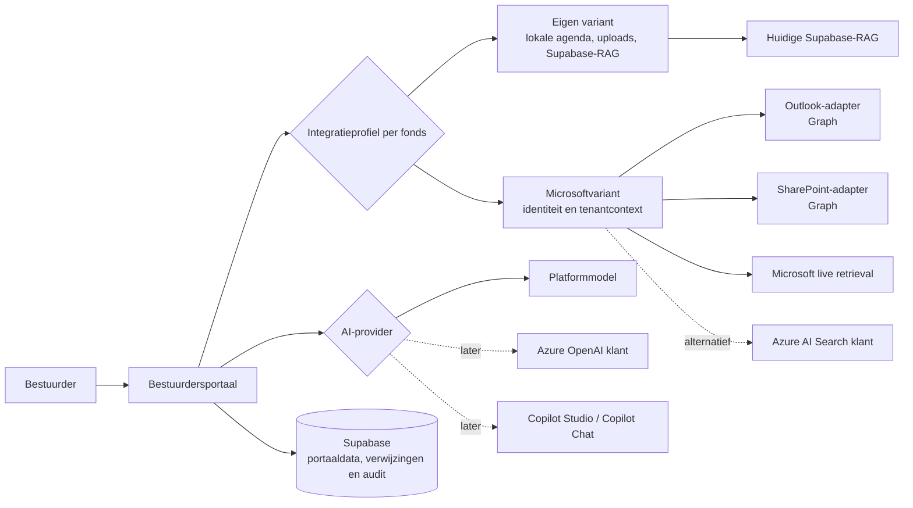

# Microsoft 365-pilot — fase 0: kader en acceptatie

- **Status:** Fase 0 afgerond; gereed voor technische inrichting
- **Datum:** 2026-09-04
- **Besluit:** [`0208`](./decisions/0208-twee-productvarianten-eigen-en-microsoft.md)
- **Eerste pilottenant:** onze eigen Microsoft 365-omgeving

## Uitkomst van fase 0

Het productvertrekpunt bestaat uit twee blijvend ondersteunde varianten:

| Productvariant | Agenda en klantdocumenten | Retrieval |
|---|---|---|
| **Eigen variant** | Lokale agenda en beveiligde uploads in het portaal | Huidige Supabase-RAG |
| **Microsoftvariant** | Outlook en SharePoint van de klant | Live Microsoft-retrieval of een expliciet gekozen Azure AI Search-alternatief |

Processen, besluiten, voorbereiding en audit blijven in beide varianten in het portaal. De
AI-provider is afzonderlijk configureerbaar. De Microsoftpilot vervangt de eigen variant dus niet,
maar bewijst dat de tweede productvariant veilig kan worden aangeboden.

We voeren eerst één verticale proef uit in onze eigen Microsoft 365-omgeving:

```text
Outlook-vergadering
        ↓
Vergadering in het bestuurdersportaal
        ↓
SharePoint-map met vergaderstukken
        ↓
Documentpreview in de browser
        ↓
Vraag via live Microsoft-retrieval
        ↓
Antwoord met controleerbare bronverwijzingen en auditrecord
```

De proef is read-only aan de Microsoft-kant. De bestaande agenda-, upload- en RAG-voorziening
blijft blijvend beschikbaar als eigen variant. Er worden nog geen klantdocumenten of embeddings
verwijderd.

Fase 0 legt vast:

- wat we in de eerste proef wel en niet bouwen;
- hoe het ene productprofiel per fonds de agenda-, document- en retrievalbron bepaalt;
- hoe de AI-provider daarvan afzonderlijk configureerbaar blijft;
- welke gegevens in Microsoft en welke in Supabase blijven;
- hoe identiteit, rechten en audit worden behandeld;
- welke praktijksituaties we testen;
- wanneer de proef een `GO`, `GO MET VOORWAARDEN` of `NO-GO` krijgt.

## Scope van de eerste proef

### Wel

- één Microsoft Entra-tenant van onszelf;
- één aangewezen Outlook-testagenda, bij voorkeur van een gedeelde mailbox;
- één SharePoint-testsite met één documentbibliotheek en één map voor vergaderstukken;
- één pilotfonds in het bestuurdersportaal;
- Outlook-afspraken read-only synchroniseren;
- SharePointdocumenten vinden, tonen en in Microsoft 365 openen of previewen;
- live Microsoft-retrieval namens de ingelogde testgebruiker;
- dezelfde testvragen ook via de huidige Supabase-RAG uitvoeren;
- bronverwijzingen, documentversie, rechten, latency, fouten en kosten vastleggen;
- het bestaande platformmodel gebruiken voor de eerste end-to-end-proef.

### Niet

- afspraken vanuit het portaal in Outlook maken of wijzigen;
- de bestaande Supabase-login vervangen door Microsoft-login;
- een klanttenant aansluiten;
- een klant-eigen Azure OpenAI- of Copilot Studio-provider activeren;
- alle bestaande SharePointsites of persoonlijke agenda's doorzoeken;
- automatisch bestanden uit SharePoint naar Supabase kopiëren;
- de bestaande documenten, tekstfragmenten of embeddings verwijderen;
- Azure AI Search voor klantdocumenten bouwen voordat live retrieval is beoordeeld.

## Doelarchitectuur



### Vier gescheiden verantwoordelijkheden

1. **Integratieprofiel** — kiest als geteste bundel de eigen of Microsoftbronlaag.
2. **Bronadapters** — lezen afspraken en documentmetadata en leveren een openingswijze.
3. **Retrieval-provider** — zoekt passages binnen de gekozen productvariant.
4. **AI-provider** — maakt het antwoord uit de reeds toegestane context en blijft afzonderlijk
   configureerbaar.

Intern blijven adapters gescheiden, maar we verkopen geen willekeurige combinaties. Per fonds is
het integratieprofiel `eigen` of `microsoft`; daaruit volgen agenda-, document- en
retrievalprovider. Een keuze voor Microsoft-retrieval mag niet automatisch een keuze voor Copilot
als generatiemodel betekenen.

Het integratieprofiel is server-side fondsconfiguratie en komt nooit uit een clientrequest. Voor
de invoering worden alle bestaande fondsen expliciet naar `eigen` gebackfilld; daarna is een
ontbrekend of ongeldig profiel een gesloten configuratiefout. Een profielwijziging is een
beheerhandeling met reden, versie en append-only audit. Frontend én API-routes gebruiken dezelfde
server-side resolver, zodat een verborgen Microsoftknop nooit de enige beveiligingsgrens is.

## Identiteit en toegang

De bestaande Supabase-sessie blijft in de proef de identiteit voor het bestuurdersportaal. Een
gebruiker koppelt daarnaast zijn zakelijke Microsoft-account. We voegen dus een verbinding toe;
we vervangen de portaal-login nog niet.

Er zijn twee verschillende toegangsmodellen:

| Gebruik | Toegang in de proef | Waarom |
|---|---|---|
| Documentpreview | Gedelegeerd, namens de ingelogde gebruiker | SharePointrechten van de gebruiker blijven leidend |
| Live retrieval | Gedelegeerd, namens de ingelogde gebruiker | De Retrieval API ondersteunt dit gebruikersmodel |
| Outlook handmatig verversen | Eerst gedelegeerd | Kleinste en eenvoudigst toetsbare start |
| Outlook achtergrondsynchronisatie | Later beperkt tot de testagenda | Vereist afzonderlijke applicatietoegang en beheermaatregelen |

### Voorlopige permissiebaseline

We vragen niet één brede set voor alle functies, maar activeren rechten per beproefde functie:

| Functie | Microsoft Graph-permissie | Aandachtspunt |
|---|---|---|
| Basis accountkoppeling | `openid`, `profile`, `offline_access`, `User.Read` | Alleen voor identiteit en sessievernieuwing |
| Gedeelde Outlook-agenda lezen | `Calendars.Read.Shared` (delegated) | Gebruiker moet al toegang tot die agenda hebben |
| Documentpreview | `Files.Read` (delegated) waar dit volstaat | Preview wordt namens de gebruiker gemaakt |
| Live SharePoint-retrieval | `Files.Read.All` én `Sites.Read.All` (delegated) | Brede scopes; admin- en securitybeoordeling is een expliciete pilotgate |
| Achtergrondsynchronisatie Outlook | `Calendars.Read` (application), pas later | Via Exchange Online Application RBAC beperken tot de aangewezen mailbox |

We voegen geen schrijfpermissies toe. Live retrieval ondersteunt geen application permissions en
wordt daarom altijd aan een ingelogde zakelijke gebruiker gekoppeld. Een foutieve KQL-filter mag
niet naar Microsoft worden gestuurd: Microsoft kan een syntactisch ongeldige filter zonder
afbakening uitvoeren. Filters worden lokaal uit een allowlist opgebouwd en vóór verzending
gevalideerd; een ongeldige filter faalt gesloten.

Tokens en secrets komen niet als gewone velden in Supabase. In Supabase bewaren we alleen de
niet-geheime koppeling, status, tenantidentiteit, scopes, laatste controle en auditverwijzingen.
De definitieve secret- en tokenopslag wordt vóór fase 1 als operationele keuze vastgelegd.

### Previewlinks zijn tijdelijke machtigingen

Een Graph-previewlink is kortlevend, maar iedereen met de URL handelt met de rechten van de
identiteit die de link heeft aangevraagd. Daarom geldt voor de proef:

- de server vraagt voor iedere previewsessie een nieuwe URL aan;
- de URL komt niet in Supabase, analytics, auditpayloads of applicatielogs;
- de URL wordt niet gedeeld tussen gebruikers en niet door de applicatie gecachet;
- de browserweergave krijgt zo min mogelijk toegang tot de omringende portaalpagina;
- we testen afzonderlijk wat er met een reeds uitgegeven URL gebeurt nadat toegang is ingetrokken.

## Gegevensgrenzen

| Gegeven | Bron van waarheid | Wat het portaal bewaart tijdens de proef |
|---|---|---|
| Afspraaktijd, deelnemers, locatie, Teams-link | Outlook | Microsoft-identifiers, synchronisatiestatus en koppeling met de portaalvergadering |
| Klantdocument | SharePoint | Documentidentifiers, versie, webadres, titel en portaalrelaties |
| Documentinhoud | SharePoint | Niet permanent; alleen tijdelijk tijdens preview of beantwoording |
| Zoekfragmenten | Microsoft of huidige RAG | Alleen het minimale bronbewijs dat voor het antwoord nodig is |
| Agendapunten, voorbereiding en besluiten | Bestuurdersportaal/Supabase | Volledig operationeel object en bestaand auditspoor |
| AI-providerconfiguratie | Bestuurdersportaal | Providerkeuze en niet-geheime configuratiereferenties per fonds |

### Minimale externe verwijzingen

Voor een Outlook-afspraak hebben we minimaal nodig:

- `tenantId`, mailbox- of kalenderidentiteit, `eventId` en `iCalUId`;
- laatst waargenomen wijzigingsmoment en synchronisatiestatus;
- de koppeling met `vergaderingen.id`.

Voor een SharePointdocument hebben we minimaal nodig:

- `tenantId`, `siteId`, `driveId` en `itemId`;
- versie-identiteit of `eTag`, webadres en laatste wijzigingsmoment;
- de koppeling met fonds, vergadering, agendapunt of dossier;
- laatste rechten-/beschikbaarheidscontrole.

Dit is in fase 0 een logisch contract. De precieze tabellen en migraties worden in fase 1
ontworpen en afzonderlijk op RLS, tenantisolatie en audit beoordeeld.

## Pilotinrichting in onze Microsoft-omgeving

### Agenda

Maak één herkenbare testagenda, bij voorkeur via een gedeelde mailbox. Neem minimaal op:

- een gewone vergadering;
- een terugkerende vergadering;
- een gewijzigde datum en locatie;
- een geannuleerde vergadering;
- een afspraak met Teams-link;
- een afspraak rond zomer-/wintertijd;
- twee afspraken met bijna gelijke titel om dubbele koppeling te testen.

### SharePoint

Maak één testsite met deze eenvoudige structuur:

```text
Bestuurdersportaal Pilot
└── Bestuursdocumenten
    └── Vergaderingen
        ├── 2026-09-15 Bestuursvergadering
        └── 2026-10-20 Bestuursvergadering
```

Neem in de testset op:

- PDF, Word, PowerPoint en Excel;
- een document met een tabel;
- een document met een afbeelding of grafiek;
- een hernoemd en verplaatst document;
- een nieuwe versie van een bestaand document;
- een document waarvoor één testgebruiker wel en één testgebruiker geen toegang heeft;
- een document waarvan toegang tijdens de proef wordt ingetrokken.

Gebruik uitsluitend synthetische of niet-vertrouwelijke testinhoud.

### Testgebruikers

- **Gebruiker A:** toegang tot agenda en alle pilotdocumenten.
- **Gebruiker B:** toegang tot agenda, maar niet tot één afgeschermd document.
- **Beheerder:** kan toestemming verlenen en intrekken en kan de audit controleren.

## Acceptatiecriteria voor de technische proef

| # | Criterium | Vereist bewijs | Grens |
|---|---|---|---|
| MS-01 | Een Outlook-afspraak wordt aan precies één portaalvergadering gekoppeld | Synchronisatielog en schermafbeelding/UI-controle | Alle agendascenario's correct, geen duplicaten |
| MS-02 | Wijziging, annulering en herhaling werken door | Voor/na-log met Microsoft-ID | Alle vastgelegde scenario's binnen het afgesproken synchronisatievenster |
| MS-03 | Een toegestaan document opent in de browser | Test per ondersteund bestandstype | PDF, Word, PowerPoint en Excel slagen |
| MS-04 | Preview maakt geen permanente bestandskopie | Opslag- en databasetoets | Geen nieuw bestand, volledige tekst of embeddings in Supabase |
| MS-05 | Een niet-toegestaan document is nergens zichtbaar of opvraagbaar | Negatieve test met gebruiker B | Nul ongeautoriseerde previews, zoekresultaten of citaties |
| MS-06 | Ingetrokken toegang wordt geëerbiedigd | Test vóór en na intrekking, inclusief reeds uitgegeven preview-URL | Een nieuwe portaalrequest faalt direct; resterende levensduur van de oude URL is gemeten en geaccepteerd |
| MS-07 | Live retrieval vindt de afgesproken relevante documenten | Vastgestelde vragen- en verwachtbronnenset | Geen kritieke bron gemist; totale kwaliteit niet slechter dan afgesproken baseline |
| MS-08 | Iedere inhoudelijke documentclaim is herleidbaar | Antwoord, bronlink, document-ID en versie | Geen verzonnen of niet-geautoriseerde bronverwijzingen |
| MS-09 | Een gewijzigde documentversie is aantoonbaar | Auditrecord vóór en na wijziging | Gebruikte versie en zoektijdstip zijn herleidbaar |
| MS-10 | Microsoft-uitval heeft een veilige uitkomst | Geforceerde fout-/timeouttest | Geen stille verbreding van bronnen; duidelijke melding of gecontroleerde terugval |
| MS-11 | Tenant- en fondscontext zijn verplicht | Negatieve API- en integratietest | Onvolledige of conflicterende context faalt gesloten |
| MS-12 | Kosten en latency zijn meetbaar | Meetrapport per retrieval- en AI-call | Geen ongemeten externe call; vergelijking met de eigen variant mogelijk |

Daarnaast gelden drie criteria voor het duale productmodel:

| # | Criterium | Vereist bewijs | Grens |
|---|---|---|---|
| DUAL-01 | De eigen variant blijft functioneel na toevoeging van Microsoft | Bestaande regressie-, RLS- en sanitytests | Geen regressie in agenda, upload, RAG, AI, processen of audit |
| DUAL-02 | Eén fonds gebruikt precies één actief integratieprofiel | Configuratie-, API- en negatieve test | Geen impliciete mix of bronconflict; onbekende configuratie faalt gesloten |
| DUAL-03 | Uitval van één variant raakt de andere niet | Geforceerde Microsoft- en providerfouten | Eigen variant blijft bruikbaar; geen automatische bronwisseling of datakopie |

Voor MS-07 maken we vóór de implementatie een kleine vaste evaluatieset met minimaal:

- tien feitvragen met één verwachte bron;
- vijf vergelijkingsvragen met meerdere bronnen;
- vijf vragen waarvoor geen antwoord in de toegestane bronnen staat;
- vijf vragen met een afgeschermd, historisch of gewijzigd document.

De huidige Supabase-RAG en live Microsoft-retrieval krijgen exact dezelfde vraag en toegestane
documentset. We vergelijken bronvondst, antwoordjuistheid, citaties, latency en kosten. Kritieke
security- en bronfouten kunnen niet door een gemiddelde kwaliteitsscore worden gecompenseerd.

## Go/no-go

### GO

Alle criteria MS-01 tot en met MS-12 en DUAL-01 tot en met DUAL-03 zijn behaald en er zijn geen
openstaande kritieke security-, privacy- of tenantisolatierisico's. We gaan door naar een beperkte
klantpilot.

### GO MET VOORWAARDEN

De verticale keten werkt veilig, maar er zijn oplosbare beperkingen in bestandsondersteuning,
latency, gebruiksgemak of kosten. De eigenaar, maatregel en uiterste beslisfase worden vastgelegd.

### NO-GO

Er is ongeautoriseerde toegang, tenantvermenging, onvoldoende bronherleidbaarheid of geen veilige
afhandeling bij uitval. De eigen variant blijft leidend. Daarna kiezen we gericht tussen
aanpassing van de live retrieval-opzet en Azure AI Search in de omgeving die de documenteigenaar
beheert.

Previewbeperkingen alleen leiden niet automatisch tot een NO-GO wanneer het document veilig in
Microsoft 365 kan worden geopend en deze overgang voor de gebruiker duidelijk is.

## Code-impact voor de volgende fasen

De inspectie van de huidige code levert deze startpunten op:

| Onderdeel | Huidige situatie | Benodigde richting |
|---|---|---|
| Login | Supabase e-mail/wachtwoord | Behouden; losse Microsoft-accountkoppeling toevoegen |
| Vergaderingen | Lokale `vergaderingen`-rijen | Externe Outlook-identiteit en syncstatus toevoegen |
| Documenten | Upload-, opslag- en verwerkingsmodel | Externe SharePointdocumenten als verwijzing modelleren |
| AI-poort | Centrale kill-switch en modelallowlist bestaan | Behouden en uitbreiden voor configureerbare providers |
| Providerabstractie | Aanwezig voor AQLab/headless generatie | Naar het productie- en streamingpad brengen |
| Productiechat | Providerkeuze is nog `anthropic` | Per fonds resolven via één centrale AI-gateway |
| Retrieval | Huidige Supabase-RAG is ingebouwd | Achter één retrieval-providercontract plaatsen |
| Fondsconfiguratie | Manifest en featureflags bestaan | Eén `integratieprofiel` per fonds; afgeleide providers; secrets elders |
| Audit | Uitgebreid, grotendeels fail-closed | Uitbreiden met Microsoftbron, versie, provider en retrievalpoging |

Fase 0 wijzigt bewust nog geen code, database, RLS-policy of Microsoft-tenant. Dit document is het
goedgekeurde kader voor de eerstvolgende implementatieopdrachten.

## Roadmap na fase 0

1. **Fase 1 — Microsoft-fundament:** Entra-app, accountkoppeling, toestemmingen, tokenopslag en
   tenantconfiguratie.
2. **Fase 2A — Outlook read-only:** afspraken koppelen en synchroniseren.
3. **Fase 2B — centrale AI-gateway:** productiechat en overige AI-taken providerconfigureerbaar
   maken. Deze fase kan parallel aan 2A.
4. **Fase 3 — SharePoint tonen:** documentreferenties, mapkoppeling en browserpreview.
5. **Fase 4 — retrieval-contract:** huidige Supabase-RAG achter de gemeenschappelijke interface.
6. **Fase 5 — live retrieval-pilot:** Microsoft-retrieval vergelijken en MS-01 tot en met MS-12
   plus DUAL-01 tot en met DUAL-03 aftekenen.
7. **Fase 6 — klant-eigen AI:** eerst Azure OpenAI; Copilotvarianten alleen afzonderlijk testen.
8. **Fase 7 — klantpilot en activering:** één klant gecontroleerd aansluiten; alleen bij dat
   Microsoftfonds dubbele opslag uitfaseren. De eigen variant blijft bestaan.

## Benodigd om fase 1 te starten

De volgende operationele gegevens moeten worden gekozen bij de inrichting; ze veranderen het
architectuurkader niet:

- naam en tenant-ID van onze Microsoft-pilottenant;
- testmailbox en testagenda;
- SharePointsite, bibliotheek en map;
- testgebruikers A en B;
- beheerder die Entra-toestemming kan verlenen;
- veilige voorziening voor secrets en tokens;
- eigenaar van de technische go/no-go-aftekening.

## Referenties

- [Besluit 0208](./decisions/0208-twee-productvarianten-eigen-en-microsoft.md)
- [Microsoft Graph — agenda's en afspraken](https://learn.microsoft.com/en-us/graph/api/resources/calendar-overview?view=graph-rest-1.0)
- [Microsoft Graph — afspraken incrementeel synchroniseren](https://learn.microsoft.com/en-us/graph/api/event-delta?view=graph-rest-1.0)
- [Microsoft Graph — documentpreview](https://learn.microsoft.com/en-us/graph/api/driveitem-preview?view=graph-rest-1.0)
- [Microsoft Graph — gedeelde agenda lezen](https://learn.microsoft.com/en-us/graph/outlook-get-shared-events-calendars)
- [Exchange Online — Application RBAC](https://learn.microsoft.com/en-us/exchange/permissions-exo/application-rbac)
- [Microsoft 365 Copilot Retrieval API](https://learn.microsoft.com/en-us/microsoft-365/copilot/extensibility/api/ai-services/retrieval/overview)
- [Retrieval API — endpoint en permissies](https://learn.microsoft.com/en-us/microsoft-365/copilot/extensibility/api/ai-services/retrieval/copilotroot-retrieval)
- [Huidige AI-poort](./core/lib/ai-poort.ts)
- [Huidige providerabstractie](./core/lib/llm-providers/types.ts)
- [Huidig document- en vergadermodel](./supabase/schema.sql)
