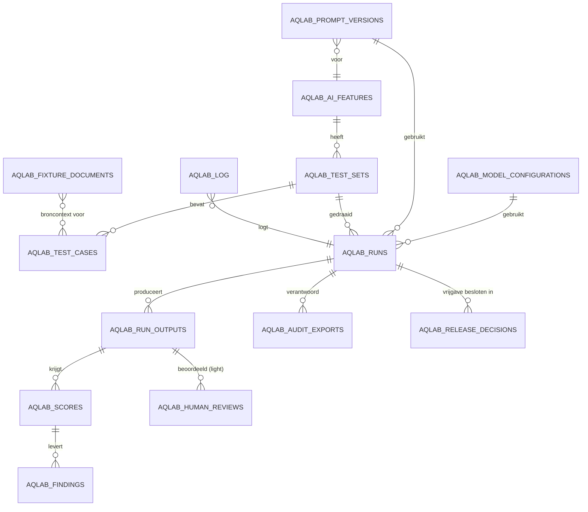
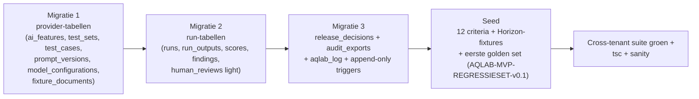

# AI Output Quality & Governance Lab — Technisch ontwerp

> **Status**: Concept **v0.5** (ter review — géén implementatie)
> **Datum**: 2026-07-10
> **Samenhang**: implementeert [`AI-QUALITY-LAB-ARCHITECTUUR.md`](./AI-QUALITY-LAB-ARCHITECTUUR.md) + [`AI-QUALITY-LAB-FUNCTIONEEL.md`](./AI-QUALITY-LAB-FUNCTIONEEL.md); golden set + consistentieconfig in [`AI-QUALITY-LAB-REGRESSIESET-v0.4.md`](./AI-QUALITY-LAB-REGRESSIESET-v0.4.md) + [`AQLAB-SEED-STRUCTUUR-v0.2.yaml`](./AQLAB-SEED-STRUCTUUR-v0.2.yaml).
> **Markering**: **[FEIT]** geverifieerd tegen codebase/migraties · **[ONTWERPKEUZE]** voorstel · **[AANNAME]** · **[OPEN]**.
> **Bron van waarheid**: de migraties in `supabase/migrations/` zijn authoritatief; dit doc is design-laag en mag t.o.v. de code achterlopen (`CLAUDE.md`).

> **Wijziging t.o.v. v0.4 (kort).** **Consistentiemeting binnen één run**: `aqlab_run_outputs` bevat al één rij per iteratie; toegevoegd zijn `consistency_required`/`consistency_iterations` op `aqlab_test_cases` (§2.3) en een **consistentie-aggregaat** in `aqlab_runs.aggregatie` (§2.6, §7A) met `consistency_score`, `gate/fact/source/format_stability`, `score_spread`, `consistency_status`, `consistency_findings`. Nieuw: **`persist_mode`** (`full_synthetic`/`none`/`metadata_only`) (§7B); consistentie in het releaseadvies (§5.6); DoD-aanvulling (§13). Volledige lijst in §14-0.

> **Wijziging t.o.v. v0.3 (kort).** `aqlab_runs` uitgebreid met **`run_type`** (`full_regression`/`subset`/`ad_hoc`) + `subset_filter`, `selected_test_case_ids`, `ad_hoc_question`, `promoted_to_testcase`, `promoted_testcase_id` (§2.6). **Ad-hoc testvraag** + **"Opslaan als testcase"**-promotie (§2.6b, §4). **Performance-aggregatie** (gemiddelde/mediaan/**P95** latency, langzaamste testcase) expliciet in de run-aggregatie (§7). **Releaseadvies per run-type** (§5.6). DoD aangevuld voor output-zichtbaarheid, latency-opslag en run-types (§13). Volledige wijzigingenlijst in §14a.

> **Wijziging t.o.v. v0.2 (kort).** Toegevoegd: aparte **`aqlab_release_decisions`**-tabel als bron van waarheid voor vrijgave (§2.13, §3, §4); lichte **`aqlab_fixture_documents`**-entiteit + fixture-beleid (§2.14, §2A); **reproduceerbare modelinstellingen** met `requested`/`effective`-scheiding (§2.5, §2.7, §2B); onderscheid **productbrede vs fonds-specifieke assurance** (§1.5); **subset-selectie** op runs. MVP-tabellenset **13 kern + 2 MVP-light**.

> **Wijziging t.o.v. v0.1 (kort).** Datamodel teruggebracht tot een minimale MVP-tabellenset. `source_snapshots`, `regression_results`, `score_criteria` en volledige `human_reviews` expliciet **later/MVP-light**. **Nullable `fonds_id` vermeden**: alle MVP-tabellen provider-owned globaal met synthetische data. RLS **per tabel**. Nieuw in v0.2: *Pre-implementation spikes* (§8) en *Definition of Done* (§13).

---

## 0. Naamgevingskeuze (besloten)

**[ONTWERPKEUZE — besloten]** **Engelse namen met `aqlab_`-prefix** (bv. `aqlab_test_cases`, `aqlab_run_outputs`). Reden: eval/LLMOps is een Engelstalig domein, en de prefix groepeert de Lab-tabellen ondubbelzinnig los van de NL-repo-conventie (`fondsen`, `governance_log`). Tenant-kolom blijft — waar later nodig — `fonds_id`, consistent met de repo. Dit vervangt de open naamgevingsvraag uit v0.1.

---

## 1. Datamodel — MVP-tabellenset

### 1.1 Overzicht (MVP)

### 1.2 De minimale MVP-tabellenset (13 kern + 2 MVP-light)

| # | Tabel | Rol | In MVP? |
| --- | --- | --- | --- |
| 1 | `aqlab_ai_features` | register van te toetsen AI-features | kern |
| 2 | `aqlab_test_sets` | benoemde verzameling testcases per feature | kern |
| 3 | `aqlab_test_cases` | één reproduceerbaar testgeval | kern |
| 4 | `aqlab_prompt_versions` | versiebeheer prompts/system-prompts | kern |
| 5 | `aqlab_model_configurations` | benoemde modelinstelling (variant-as), requested + effective | kern |
| 6 | `aqlab_runs` | uitvoering (testset × prompt × modelconfig), incl. regressie-JSON + subset-selectie | kern |
| 7 | `aqlab_run_outputs` | AI-resultaat per (run × testcase × iteratie) + snapshot-refs + effectieve instellingen | kern |
| 8 | `aqlab_scores` | score per (output × criterium) met methode/bewijs | kern |
| 9 | `aqlab_findings` | concrete bevindingen/afwijkingen per score | kern |
| 10 | `aqlab_release_decisions` | **bron van waarheid voor vrijgave** (welke run/prompt/model officieel is vrijgegeven) | kern |
| 11 | `aqlab_audit_exports` | onveranderlijk auditdossier per run/release | kern |
| 12 | `aqlab_fixture_documents` | register van synthetische/demodocumenten (golden data) | kern |
| 13 | `aqlab_log` | append-only auditspoor van Lab-acties | kern |
| 14 | `aqlab_human_reviews` | menselijke aftekening (**MVP light**, geen workflow) | MVP light |
| 15 | `aqlab_score_criteria` | beheerbare criteria (**later**; MVP = seed in code) | later |

### 1.3 Expliciet later / MVP-light

| Entiteit | Beslissing | MVP-invulling |
| --- | --- | --- |
| `human_reviews` | **MVP light** — geen volledig workflowmanagement | Lichte tabel `aqlab_human_reviews`: alleen oordeel + motivatie + reviewer; geen toewijzing/SLA/queue-beheer |
| `source_snapshots` | **MVP `refs_only`** — geen materialized content tenzij noodzakelijk | Refs + hash + retrieval-filter als **JSON-velden in `aqlab_run_outputs`**; aparte tabel `aqlab_source_snapshots` = later (materialized) |
| `regression_results` | **MVP als afgeleide** — JSON in run-aggregatie | Regressie-uitkomst als JSON in `aqlab_runs.aggregatie`; aparte tabel `aqlab_regression_results` pas als trend/branching nodig is |
| `evaluation_score_criteria` | **MVP vaste seedcriteria** — beheerbaarheid later | 12 criteria als seed-constante in code (`lib/aqlab/criteria.ts`); een beheerbare tabel `aqlab_score_criteria` = later |

### 1.4 Scope-classificatie en tenant-isolatie (MVP)

**[ONTWERPKEUZE]** In de MVP zijn **alle** tabellen **provider-owned globaal** (Optie A + synthetische golden data). Dat elimineert de nullable-`fonds_id`-complexiteit uit v0.1.

| Tabel | Bevat het ruwe fondscontent? | `fonds_id`? |
| --- | --- | --- |
| `aqlab_ai_features` | Nee (register) | nee |
| `aqlab_test_sets` | Nee (synthetisch/demodata) | nee |
| `aqlab_test_cases` | Nee (synthetisch/demodata) | nee |
| `aqlab_prompt_versions` | Nee (productcode-achtig) | nee |
| `aqlab_model_configurations` | Nee (config) | nee |
| `aqlab_runs` | Nee (metadata + aggregatie) | nee |
| `aqlab_run_outputs` | Nee in MVP (synthetische context/output) | nee |
| `aqlab_scores` | Nee (scores/motivatie op synthetische output) | nee |
| `aqlab_findings` | Nee | nee |
| `aqlab_release_decisions` | Nee (besluitmetadata over synthetische run) | nee |
| `aqlab_human_reviews` | Nee (review op synthetische output) | nee |
| `aqlab_audit_exports` | Nee (bevroren rapport over synthetische run) | nee |
| `aqlab_fixture_documents` | Nee (synthetisch, `synthetic = true` afgedwongen) | nee |
| `aqlab_log` | Nee (Lab-acties provider-side) | nee |

> **[ONTWERPKEUZE] Concreet welke tabellen nooit ruwe fondscontent bevatten (MVP)**: álle bovenstaande, omdat de golden set synthetisch/demodata is. **Welke tabellen mogelijk ruwe output/context bevatten (en dus RLS, retentie en audit vereisen)**: uitsluitend de **latere** fonds-scoped uitbreidingen — `aqlab_source_snapshots` (materialized), fonds-eigen `aqlab_test_sets`/`aqlab_run_outputs` bij een fonds-specifieke assurance-run, en fonds-`aqlab_human_reviews`. Díe krijgen `fonds_id NOT NULL` + RLS + `WITH CHECK`. Ze worden pas ontworpen wanneer die uitbreiding op de roadmap komt.

### 1.5 Productbrede vs fonds-specifieke assurance (scope van wat de MVP toetst)

**[ONTWERPKEUZE]** Doordat de MVP volledig op provider-owned synthetische data draait, toetst de MVP **productbrede AI-featurekwaliteit**, niet de kwaliteit van AI-output op echte fondsdocumenten. Dit onderscheid is expliciet en werkt door in datamodel, assurance-API en rapportage.

| Aspect | **Product-assurance** (MVP) | **Fonds-specifieke assurance** (later) |
| --- | --- | --- |
| Wat wordt getoetst | AI-feature, prompt, modelconfiguratie, uitvoergedrag | Kwaliteit op echte fondsdocumenten / fonds-eigen testsets |
| Testdata | Synthetisch/representatief (`aqlab_fixture_documents`, `synthetic = true`) | Echte fondsdocumenten (fonds-scoped) |
| Rol in release | Onderdeel van productrelease + regressiecontrole | Aanvullende fondsvalidatie |
| Datamodel | Provider-owned globaal, geen `fonds_id` | Fonds-scoped: `fonds_id NOT NULL` + RLS + `WITH CHECK` |
| Retentie/audit | Licht (synthetische data) | Strikt (AVG, retentiebeleid, striktere audit) |
| Scope | **In MVP** | **Niet in MVP — latere uitbreiding** |

Elk rapport en elke export draagt daarom een `assurance_scope`-markering (`productbreed`/`fonds_specifiek`). In de MVP is die waarde altijd `productbreed`. De assurance-service (§5.8) en het functioneel ontwerp (§5) tonen deze scope expliciet en voegen de uitleg toe dat een productbrede controle op representatieve testgevallen is uitgevoerd en niet bewijst dat elk fondsdocument inhoudelijk is gevalideerd.

---

## 2. Entiteiten (detail — MVP)

> Per entiteit: **doel · belangrijkste velden · relaties · RLS · MVP-velden · later**. Types indicatief Postgres.

### 2.1 `aqlab_ai_features`
**Doel**: register van AI-features die getoetst worden — tevens de "AI-use-case-inventaris" die `AI-GOVERNANCE-ONTWERP.md` §5 als ontbrekend gat benoemt.
**Velden**: `id uuid pk` · `code text unique` (bv. `bestuurlijke_samenvatting`) · `naam text` · `doel text` · `geraakt_proces text` · `risicocategorie text` check (`minimaal`/`beperkt`/`hoog`/`nader_beoordelen`) · `human_in_the_loop_maatregel text` · `status text` check (`ontwerp`/`pilot`/`productie`/`retired`) · `eigenaar text` · `aangemaakt_op/_door`.
**Relaties**: 1—n `aqlab_test_sets`, `aqlab_prompt_versions`.
**MVP**: `code`, `naam`, `doel`, `risicocategorie`, `status`, `human_in_the_loop_maatregel`. **Later**: `geraakt_proces`, AI-Act-classificatiekoppeling.

### 2.2 `aqlab_test_sets`
**Doel**: benoemde, herbruikbare verzameling testcases per feature (de "golden set").
**Velden**: `id` · `feature_id fk` · `code text unique` **[AS-BUILT AQL-1]** (natuurlijke sleutel, loader-idempotentie: `samenvatting`/`vraagbeantwoording`/`besluitvoorbereiding`/`security_safety`) · `naam text` · `omschrijving` · `versie int` · `status text` (`actief`/`verouderd`/`gearchiveerd`) · `aangemaakt_op/_door`.
**Relaties**: n—1 feature (nullable — de `security_safety`-set heeft `feature_id = null`); 1—n testcases; 1—n runs.
**MVP**: `feature_id`, `naam`, `versie`, `status`. **Later**: `scope`-kolom + `fonds_id` voor fonds-eigen sets.
**Let op**: géén `scope`/`fonds_id` in MVP — golden sets zijn provider-globaal en synthetisch.

### 2.3 `aqlab_test_cases`
**Doel**: één reproduceerbaar testgeval (de kern van reproduceerbaarheid).
**Velden**: `id` · `test_set_id fk` · `feature_id fk` · `code text` (bv. `BS-01`, `SEC-03` — koppelt aan de regressieset) · `titel` · `gebruikersvraag text` · `gebruikersrol text` (bestuurder/bestuursbureau/commissie/adviseur) · `broncontext_ref jsonb` (verwijzing naar `aqlab_fixture_documents` — synthetische demodocumenten) · `verwachte_outputvorm text` · `verplichte_onderdelen jsonb` (lijst toetsbare eisen) · `blokkadecriteria jsonb` (lijst harde criteria) · `minimale_acceptatiescore int` (0–100) · `soort text` check (`functioneel`/`security_blocking`) · `kritikaliteit text` check (`kritiek`/`hoog`/`middel`/`laag`) · `tags text[]` (**vrije labels voor subset-selectie**, bv. `compliance`, `hallucinatie`, `autorisatie`) · `review_verplicht bool` · `herhalingen int` default 3 · `spec jsonb` **[AS-BUILT AQL-1]** (geseede testcase-spec: `expected_facts`/`outline`/`checks` uit de golden set) · `actief bool` · `aangemaakt_op/_door`.
**Relaties**: n—1 testset; n—n `aqlab_fixture_documents` **via de koppeltabel `aqlab_test_case_fixtures`** (§2.14b); 1—n run_outputs.
**Consistentievelden (v0.5)**: `consistency_required bool default false` · `consistency_iterations int default 3` check (3 of 5). Bepalen of een testcase binnen één run meerdere keren als iteratie draait; de gedeelde dimensies/pass-regels/toegestane variatie staan in de seedconfig (`AQLAB-SEED-STRUCTUUR-v0.1.yaml` → `consistency.global`) en in `lib/aqlab/consistency.ts`.
**MVP**: alle bovenstaande. `code`, `soort` en `tags` maken subset-selectie (§2.6) en koppeling met de regressieset mogelijk; `consistency_required`/`consistency_iterations` sturen de consistentiemeting. **Later**: multi-turn/full-funnel-vragen.

### 2.4 `aqlab_prompt_versions`
**Doel**: versiebeheer van prompts/system-prompts per feature — herleidbaarheid output→prompt.
**Velden**: `id` · `feature_id fk` · `soort text` (`user_prompt`/`system_prompt`/`answer_template`/`guardrail`) · `versie int` · `inhoud text` · `checksum text` · `actief_in_productie bool` · `notitie` · `aangemaakt_op/_door`.
**Relaties**: n—1 feature; 1—n runs.
**RLS**: provider-globaal; append-only aanbevolen (nieuwe versie i.p.v. edit).
**MVP**: alle bovenstaande. **Later**: diff-weergave, goedkeuringsstatus.

### 2.5 `aqlab_model_configurations`
**Doel**: herbruikbare, benoemde modelinstelling (variant-as). **Reproduceerbaarheid is leidend**: een run mag alleen met een baseline worden vergeleken als de *effectieve* instellingen bekend zijn — daarom scheiden we **gevraagd** (`_requested`) van **effectief** (`_effective`).
**Velden (gevraagd/config)**: `id` · `naam` · `model_provider text` (bv. `anthropic`) · `model_name text` (bv. exact `AI_MODEL`) · `model_version text null` (indien de provider een versie/snapshot teruggeeft) · `temperature_requested numeric null` (null = bewust de provider-default overnemen) · `max_tokens_requested int null` · `top_p_requested numeric null` · `retrieval_settings jsonb` (chunking/zoekstrategie/topK, gevraagd) · `guardrails jsonb` · `is_baseline bool` · `aangemaakt_op/_door`.
**Effectieve velden (vastgelegd per run, zie §2.7)**: de daadwerkelijk toegepaste waarden worden **niet** hier maar op `aqlab_run_outputs` bevroren, omdat defaults per modelversie kunnen verschuiven.
**Relaties**: 1—n runs.
**RLS**: provider-globaal; append-only aanbevolen (nieuwe config i.p.v. edit) zodat een release naar een onveranderlijke config verwijst.
**MVP**: alle bovenstaande. **Later**: multi-model-orchestration-profielen (expliciet buiten MVP).

> **[ONTWERPKEUZE — reproduceerbaarheid modelinstellingen] (§2B).** Voor AQLab-runs worden de **effectieve** instellingen altijd opgeslagen. Testconfiguraties worden bij voorkeur **expliciet gezet** (temperature, max_tokens, top_p, retrieval), ook als productie nu de provider-default gebruikt; als een default wordt overgenomen, legt de run dat vast via `provider_default_used = true` mét de effectief teruggekomen waarde. Een `temperature_requested = null` is daarmee geen bron van onduidelijkheid meer: `temperature_effective` en `provider_default_used` maken achteraf altijd herleidbaar wat er werkelijk draaide. Een regressievergelijking is **alleen geldig** als beide varianten volledige effectieve instellingen hebben.

### 2.6 `aqlab_runs`
**Doel**: één uitvoering van (testset × prompt_version × model_configuration), evt. tegen een baseline. **Bevat de regressie-uitkomst als JSON** (geen aparte tabel in MVP).
**Velden**: `id` · `run_type text` check (`full_regression`/`subset`/`ad_hoc`) · `test_set_id fk null` (null bij ad-hoc) · `prompt_version_id fk` · `model_configuration_id fk` · `baseline_run_id uuid null` · `rol text` check (`baseline`/`challenger`) · `soort text` check (`functioneel`/`security_blocking`) · `subset_filter jsonb null` (de gekozen filtercriteria) · `selected_test_case_ids uuid[] null` (welke testcases daadwerkelijk liepen) · `ad_hoc_question text null` (bij `run_type = ad_hoc`) · `promoted_to_testcase bool default false` · `promoted_testcase_id uuid null` (→ `aqlab_test_cases`) · `gewijzigde_as text` check (`prompt`/`model`/`temperature`/`max_tokens`/`retrieval`/`geen`/`meerdere`) · `atomair bool` · `status text` check (`queued`/`running`/`done`/`failed`/`cancelled`) · `gestart_door` · `gestart_op` · `voltooid_op` · `persist_mode text` check (`full_synthetic`/`none`/`metadata_only`) default `full_synthetic` (§7B) · `aggregatie jsonb` (gem. score, pass-rate, #verbeteringen, #regressies, #blokkades, #openstaande_reviews, **regressie-delta's per testcase**, **release_advies**, **performance-blok**: `latency_gem`/`latency_mediaan`/`latency_p95`/`langzaamste_test_case_id`, `tokens_in`/`tokens_out`, `kosten_indicatie`, **consistentie-blok per testcase**: zie §7A) · `kostenplafond numeric null` · `totale_kosten numeric null` · `notitie`.
**Relaties**: 1—n outputs, audit_exports, release_decisions; n—1 `promoted_testcase_id`.
**MVP**: alle bovenstaande; `kostenplafond`/`totale_kosten` optioneel. **Later**: geplande/terugkerende runs; aparte `aqlab_regression_results`-tabel.

> **[ONTWERPKEUZE — run_type].** Drie soorten runs (Functioneel §2.5): **`full_regression`** (volledige golden set → kan formeel releaseadvies geven), **`subset`** (deelselectie → indicatief) en **`ad_hoc`** (één eigen vraag → geen formeel advies). `run_type` wordt overal in de rapportage getoond en bepaalt of een `aqlab_release_decisions`-regel formeel mag zijn (§5.6b).

> **[ONTWERPKEUZE — subset-selectie].** Bij `run_type = subset` legt **`subset_filter jsonb`** de gekozen filters vast: `{ "features": [...], "kritikaliteit": [...], "tags": [...], "vorige_status": ["regressie","nieuwe_blokkade","gefaald"], "alleen_review_verplicht": bool, "alleen_security_safety": bool, "handmatig": [test_case_ids...] }`. **`selected_test_case_ids`** legt de daadwerkelijk gedraaide testcases letterlijk vast (herleidbaar/herhaalbaar). Regels: (1) een subsetrun is een geldige regressievergelijking **alleen** tegen dezelfde subset van de baseline; (2) de **security/safety-set** (`soort = security_blocking`) draait bij voorkeur apart en wordt altijd meegenomen vóór vrijgave — een subset zonder de blocking-set kan nooit tot `release_advies = accepteren` leiden; (3) een subsetrun levert een **indicatief** advies (§5.6b). Selectie steunt op `aqlab_test_cases.tags`/`kritikaliteit`/`soort` (§2.3) en op de vorige-run-status.

### 2.6b Ad-hoc testvraag en promotie naar testcase
**Ad-hoc run** (`run_type = ad_hoc`): een run zonder testset, met `ad_hoc_question` + gekozen fixtures (`broncontext_ref`) + variant. Produceert normale `aqlab_run_outputs` (volledige output, bronnen, herkomstlabels, latency, tokens, kosten, checks, optionele judge, optionele reviewnotitie), maar **telt niet mee** voor een formele regressiescore en levert **geen** formeel releaseadvies.
**Promotie ("Opslaan als testcase", Functioneel §5a)**: maakt een `aqlab_test_cases`-rij aan uit de ad-hoc vraag. **Vereist** (service- en UI-validatie): opgeslagen vraag, vastgelegde broncontext/fixture, verwachte outputvorm, verplichte onderdelen, blokkadecriteria, minimale score, reviewverplichting. **Keuzes bij opslaan**: bestaande/nieuwe testset, testcase-`code`, titel, kritikaliteit, minimale acceptatiescore, review verplicht, machine-toetsbare specificatie indien beschikbaar. Na promotie: `promoted_to_testcase = true` + `promoted_testcase_id` op de bron-run. De ad-hoc run zelf telt niet met terugwerkende kracht mee.

### 2.7 `aqlab_run_outputs`
**Doel**: het concrete AI-resultaat per (run × testcase × iteratie) met alle metadata **en de snapshot-refs** (refs_only).
**Velden**: `id` · `run_id fk` · `test_case_id fk` · `iteratie int` · `inputvraag text` · `gebruikte_context jsonb` (synthetisch) · `gegenereerd_antwoord text` · `gebruikte_bronnen jsonb` (`[Bron N]`-refs) · `herkomstlabels jsonb` · `snapshot_refs jsonb` (document-/chunk-ID's) · `snapshot_hash text` (sha256 over gebruikte chunks) · `retrieval_filter jsonb` · **effectieve modelinstellingen** (`model_name text` · `model_version text null` · `temperature_effective numeric null` · `max_tokens_effective int null` · `top_p_effective numeric null` · `provider_default_used bool` · `retrieval_settings_effective jsonb`) · `prompt_version_id fk` · `tokengebruik jsonb` (in/out) · `latency_ms int` · `kosten_indicatie numeric null` · `foutmelding text null` · `timestamp` · `gestart_door`.
**Relaties**: n—1 run/testcase; 1—n scores, human_reviews.
**[ONTWERPKEUZE]** De effectieve instellingen worden per output bevroren (niet alleen op de config), zodat een historische run reproduceerbaar en vergelijkbaar blijft, ook als de provider-default later wijzigt.
**RLS**: provider-globaal in MVP (synthetische content). **Bij latere fonds-run**: `fonds_id` + RLS + `WITH CHECK` + retentiebeleid — dit is de tabel die dán ruwe context/output kan bevatten.
**MVP**: kernvelden (input, antwoord, bronnen, snapshot-refs/hash, model, tokens, latency, fout, timestamp). **Later**: `kosten_indicatie`, verplaatsing snapshot naar aparte tabel bij materialized.

### 2.8 `aqlab_scores`
**Doel**: score per (output × criterium), met methode, bewijs en beperking.
**Velden**: `id` · `run_output_id fk` · `criterium_code text` (verwijst naar seedcriterium in `lib/aqlab/criteria.ts`) · `methode text` check (`deterministisch`/`heuristisch`/`llm_judge`/`human`) · `score numeric` (0–100 of pass/fail genormaliseerd) · `pass bool` · `motivatie text` · `bewijs jsonb` (matchende brontekst/regelverwijzing) · `judge_model text null` · `beoordeeld_op` · `beoordeeld_door uuid null`.
**Relaties**: n—1 output; 1—n findings.
**MVP**: `criterium_code`, `methode`, `score`, `pass`, `motivatie`, `judge_model`. **Later**: rijk gestructureerd `bewijs`.

### 2.9 `aqlab_findings`
**Doel**: concrete bevindingen/afwijkingen per score (audit-detail).
**Velden**: `id` · `score_id fk` · `run_output_id fk` · `type text` (`hallucinatie`/`bron_ontbreekt`/`format`/`autorisatie`/`herkomstlabel`/`overig`) · `ernst text` check (`kritiek`/`hoog`/`middel`/`laag`) · `omschrijving text` · `fragment text null` · `status text` (`open`/`geaccepteerd`/`opgelost`) · `aangemaakt_op`.
**Relaties**: n—1 score/output.
**MVP**: `type`, `ernst`, `omschrijving`, `status`. **Later**: koppeling naar issue-tracker.

### 2.10 `aqlab_audit_exports`
**Doel**: onveranderlijk auditdossier per run/release voor bestuur/auditor; ook de bron van de read-only fonds-download.
**Velden**: `id` · `run_id fk` · `feature_id fk` · `inhoud_hash text` (sha256 over het bevroren rapport) · `formaat text` (`html`/`pdf`) · `opslag_ref text` (Supabase Storage) · `besluit text null` (`vrijgegeven`/`geblokkeerd`) · `besluit_door uuid null` · `besluit_op timestamptz null` · `gegenereerd_door` · `gegenereerd_op`.
**Relaties**: n—1 run/feature.
**RLS/audit**: provider-owned; append-only (nooit UPDATE/DELETE). Fonds leest read-only via assurance-API voor features die het gebruikt. **Later**: per-fonds export bij fonds-specifieke run.
**MVP**: `run_id`, `inhoud_hash`, `formaat`, `opslag_ref`, `besluit`, `besluit_door/_op`.

### 2.11 `aqlab_log`
**Doel**: append-only auditspoor van Lab-acties (run gestart/voltooid, variant gewijzigd, besluit genomen) — analoog aan `fonds_config_log` (ADR 0051).
**Velden**: `id` · `gebruiker_id` · `gebruiker_naam` · `actie text` · `object_type text` · `object_id uuid` · `oude_waarde jsonb` · `nieuwe_waarde jsonb` · `aangemaakt_op`.
**RLS/audit**: `enable row level security`; triggers `fn_log_append_only` blokkeren UPDATE/DELETE (**[FEIT]** bestaande functie hergebruiken). Geen `fonds_id` in MVP (provider-acties).

### 2.12 `aqlab_human_reviews` (MVP light)
**Doel**: menselijke aftekening/overrule van een output — **light**: geen toewijzing, queue-beheer of SLA.
**Velden**: `id` · `run_output_id fk` · `reviewer_id uuid` · `oordeel text` check (`bevestigd`/`overruled`/`geblokkeerd`) · `score_override numeric null` · `motivatie text` (verplicht bij overrule/blokkade) · `beoordeeld_op`.
**Relaties**: n—1 output.
**RLS**: provider-globaal in MVP (provider-reviewer via `aqlab:review`). **Later (fonds-review)**: `fonds_id` + RLS + `WITH CHECK` + `validatie_domein`-match.
**MVP**: `oordeel`, `motivatie`, `reviewer_id`, `score_override`. **Later**: reviewtoewijzing/SLA, `validatie_domein`, fondsreviewers.

### 2.13 `aqlab_release_decisions`
**Doel**: **de bron van waarheid voor vrijgave** — welke run, promptversie en modelconfiguratie officieel is vrijgegeven, door wie, waarom, met welk auditrapport, en of kritieke bevindingen de vrijgave blokkeerden. **[ONTWERPKEUZE — gekozen: optie A, aparte tabel]** boven losse releasevelden op `aqlab_runs`, omdat een release een apart, append-only besluit is met een eigen levenscyclus (een run kan meerdere besluitmomenten kennen: eerst `review_vereist`, later `vrijgegeven`), en omdat het de assurance-view een schone, ondubbelzinnige "laatst vrijgegeven"-bron geeft.
**Velden**: `id uuid pk` · `run_id fk` · `feature_id fk` · `prompt_version_id fk` · `model_configuration_id fk` · `release_status text` check (`concept`/`getest`/`review_vereist`/`aangepast`/`vrijgegeven`/`geblokkeerd`/`gearchiveerd`) · `release_advies text` check (`accepteren`/`aanpassen`/`blokkeren`) · `besluit text null` check (`vrijgegeven`/`geblokkeerd`) · `besluit_door uuid null` · `besluit_op timestamptz null` · `motivatie text` (verplicht bij afwijken van het advies) · `kritieke_bevindingen_count int` · `assurance_scope text` check (`productbreed`/`fonds_specifiek`) default `productbreed` · `audit_export_id fk null` (→ `aqlab_audit_exports`) · `aangemaakt_op timestamptz`.
**Relaties**: n—1 run/feature/promptversie/modelconfig; n—1 audit_export.
**RLS/audit**: provider-owned; **append-only** (`fn_log_append_only`) — een besluit wordt nooit ge-UPDATE, een statuswijziging is een nieuwe regel. `release_status = vrijgegeven` vereist `besluit = vrijgegeven` + `besluit_door`/`_op` gevuld.
**Beslisregel (hard, DB + service):** `kritieke_bevindingen_count > 0` ⇒ `besluit` mag niet `vrijgegeven` zijn en `release_advies` kan niet `accepteren` zijn. De laatst geldige vrijgave per feature is de meest recente regel met `release_status = vrijgegeven`.
**MVP**: alle bovenstaande. **Later**: koppeling change-control/ticket; fonds-scoped besluiten bij fonds-specifieke assurance.

### 2.14 `aqlab_fixture_documents`
**Doel**: register van de **synthetische/demodocumenten** (golden data, demofonds *Horizon*) waarop testcases draaien — zodat testdata een expliciete, geversioneerde, herleidbare entiteit is en er geen echte fondsdocumenten in de golden set belanden.
**Velden**: `id uuid pk` · `code text unique` (bv. `HOR-MEMO-01`) · `titel text` · `documenttype text` (bestuursmemo/naslagbron/besluitmemo/actielijst/…; zie regressieset §Seeddata) · `feature_id fk null` (optioneel: primair bedoeld voor een feature) · `versie int` · `opslag_ref text null` (Supabase Storage-pad) · `repo_path text null` (repo-fixture-pad) · `content_hash text` (sha256 over de canonieke inhoud) · `synthetic bool` **default true, `CHECK (synthetic = true)`** · `aangemaakt_op/_door`.
**Relaties**: n—n `aqlab_test_cases` (via `broncontext_ref`/koppeltabel).
**RLS/audit**: provider-owned globaal; mutaties append-only gelogd in `aqlab_log`.
**[ONTWERPKEUZE — fixturebeleid] (§2A)**: zie de aparte sectie hieronder voor opslag, versionering, hashbepaling, borging tegen echte fondsdata en UI-markering.
**MVP**: alle bovenstaande. **Later**: fixture-generatoren, meertalige varianten.

### 2.14b `aqlab_test_case_fixtures` **[AS-BUILT AQL-1]**
**Doel**: genormaliseerde n—n-koppeling tussen testcase en synthetische fixture, zodat de post-seed-verificatie de bidirectionele koppeling sluitend kan toetsen. De `broncontext_ref jsonb` op `aqlab_test_cases` blijft de gedenormaliseerde snapshot; deze koppeltabel is de genormaliseerde waarheid.
**Velden**: `test_case_id fk` · `fixture_document_id fk` · `rol text` check (`required`/`excluded`) · pk (`test_case_id`,`fixture_document_id`,`rol`).
**Relaties**: n—1 testcase; n—1 fixture.
**RLS**: provider-globaal, deny-by-default (decision 0058) — géén permissive policy; toegang server-side via de platform-service-role-wrapper.
**MVP**: alle bovenstaande.

> **[AS-BUILT — ontwerp-sync AQL-1]** De koppeltabel `aqlab_test_case_fixtures` is toegevoegd in migratie `2026_07_10_aqlab_1_register.sql` (§5) en vervangt in de tabellenset (§1.2) de plek van het *nog niet gebouwde* `aqlab_score_criteria` (dat blijft "later" — de 14 scorecriteria zijn code-seed in `lib/aqlab/criteria.ts`). Netto blijft het aantal MVP-tabellen 15. Autorisatie: **decision 0058** (deny-by-default + service-role-wrapper i.p.v. capability-policy).

### 2A. Fixture-/demodatabeleid (waar de golden data leeft)

**[ONTWERPKEUZE]** De MVP gebruikt uitsluitend synthetische data. Beleid:

- **Opslag (combinatie).** De canonieke bron is een **repo-fixture** (`fixtures/aqlab/horizon/…`, mee te versioneren met de code, reviewbaar via PR). Bij runtime worden documenten die door retrieval verwerkt moeten worden geladen in **Supabase Storage** onder een dedicated, duidelijk gemarkeerde demo-namespace. `aqlab_fixture_documents` is het **register** (metadata + hashes) dat naar beide verwijst (`repo_path` en/of `opslag_ref`). De database bevat dus metadata, niet de ruwe bestanden.
- **Versionering.** Elke inhoudelijke wijziging = nieuwe `versie` (append; oude versie blijft bestaan) zodat historische runs naar de exacte versie blijven verwijzen. De repo-fixture is de single source; de PR-review is het wijzigingsspoor.
- **`snapshot_hash`/`content_hash`.** `content_hash` = sha256 over de **canonieke inhoud** van het fixture-document (genormaliseerd: encoding/whitespace-stabiel). Een run legt per output een `snapshot_hash` vast = sha256 over de **daadwerkelijk aan het model meegegeven chunks** (dus inclusief retrieval-selectie), plus de `snapshot_refs` naar de betrokken fixture-document-ID's + versies. Zo is zowel de brón (content_hash) als de gebruikte selectie (snapshot_hash) verifieerbaar.
- **Borging tegen echte fondsdata.** `synthetic bool CHECK (synthetic = true)` op `aqlab_fixture_documents`; een testcase mag in de MVP alleen fixtures met `synthetic = true` als broncontext hebben (service- en DB-check). De demo-namespace in Storage is fysiek gescheiden van tenant-buckets. Een cross-tenant/fixture-test in `tests/cross-tenant/*` faalt als een golden-set-testcase naar niet-synthetische content verwijst.
- **UI-markering.** In scherm 2 (testcase-detail) en op de scorekaart toont een expliciete **"synthetische demodata (demofonds Horizon)"**-badge dat de broncontext synthetisch is; de assurance-view vermeldt dat de controle op representatieve testgevallen is uitgevoerd (§5, functioneel).

---

## 3. RLS-matrix (per tabel, MVP)

**[ONTWERPKEUZE]** In de MVP zijn alle tabellen provider-owned; toegang loopt via `platform_identity_capabilities`, niet via tenant-RLS. RLS staat wel **aan** op elke tabel (conform `CLAUDE.md`), met policies die uitsluitend platform-capabilities toelaten. De fonds-leestoegang loopt **niet** via een tabel-policy maar via een gecureerd server-side assurance-endpoint.

| Tabel | RLS aan | Wie mag lezen | Wie mag schrijven | `WITH CHECK` | Verplichte cross-tenant test |
| --- | --- | --- | --- | --- | --- |
| `aqlab_ai_features` | ja | `aqlab:*` (platform); fonds via assurance-API (features enabled) | `aqlab:beheer` | n.v.t. (geen fonds_id) | features/register lekken geen fondscontent |
| `aqlab_test_sets` | ja | `aqlab:*` | `aqlab:beheer` | n.v.t. | synthetische inhoud aantoonbaar |
| `aqlab_test_cases` | ja | `aqlab:*` | `aqlab:beheer` | n.v.t. | broncontext = synthetisch |
| `aqlab_prompt_versions` | ja | `aqlab:*` | `aqlab:beheer` | n.v.t. | geen fonds-content |
| `aqlab_model_configurations` | ja | `aqlab:*` | `aqlab:beheer` | n.v.t. | — |
| `aqlab_runs` | ja | `aqlab:*` | `aqlab:beheer`/systeem | n.v.t. | aggregatie lekt geen ruwe content |
| `aqlab_run_outputs` | ja | `aqlab:*` | systeem (orchestrator) | n.v.t. | output = synthetisch; assurance-API geeft nooit ruwe output aan fonds |
| `aqlab_scores` | ja | `aqlab:*` | systeem/`aqlab:beheer` | n.v.t. | — |
| `aqlab_findings` | ja | `aqlab:*` | systeem/`aqlab:review` | n.v.t. | — |
| `aqlab_release_decisions` | ja | `aqlab:*`; fonds leest **alleen laatst-vrijgegeven status** via assurance-API | `aqlab:govern`; **append-only** | n.v.t. | besluit lekt geen ruwe content; scope-veld correct |
| `aqlab_human_reviews` | ja | `aqlab:*` | `aqlab:review` | n.v.t. in MVP | — |
| `aqlab_audit_exports` | ja | `aqlab:*`; fonds read-only via assurance-API | `aqlab:beheer`/`aqlab:govern`; **append-only** | n.v.t. | export bevat geen cross-tenant ruwe content |
| `aqlab_fixture_documents` | ja | `aqlab:*` | `aqlab:beheer` | n.v.t. | `synthetic = true` afgedwongen; geen echte fondsdata |
| `aqlab_log` | ja | `aqlab:*` | systeem; **append-only** (UPDATE/DELETE geblokkeerd) | n.v.t. | append-only-trigger actief |

**Latere fonds-scoped tabellen** (buiten MVP) — RLS-eisen vooraf vastgelegd:

| Tabel (later) | Wie leest | Wie schrijft | `WITH CHECK` | Cross-tenant test |
| --- | --- | --- | --- | --- |
| `aqlab_source_snapshots` (materialized) | eigen fonds | systeem onder fonds-context | `fonds_id = (select fonds_id from profielen where id = auth.uid())` | fonds A ziet nooit snapshots van fonds B |
| fonds-eigen `aqlab_test_sets`/`aqlab_run_outputs` | eigen fonds | fonds-`beheerder`/systeem | idem | strikte isolatie + geen aggregatielek |
| fonds-`aqlab_human_reviews` | eigen fonds + `validatie_domein`-match | fonds-reviewer | idem + domein-match server-side | reviewer buiten domein/fonds geweigerd |

**Cross-tenant-garantie (MVP)**: de assurance-API is het enige pad waarlangs een fonds Lab-data ziet; hij geeft **uitsluitend geaggregeerde scores/metadata** terug voor features die het fonds gebruikt, **nooit** ruwe output, context of prompts. Voeg dedicated AQLab-cases toe aan `tests/cross-tenant/*` (§10).

---

## 4. API-endpoints

**[ONTWERPKEUZE]** Next.js App Router route handlers. Beheer onder platform-namespace `app/(platform)/platform/(beveiligd)/aqlab/…` + services onder `app/api/aqlab/…`; de read-only assurance-endpoints onder het tenant-pad. Autorisatie server-side (nooit alleen UI).

| Methode + route | Doel | Autorisatie |
| --- | --- | --- |
| `GET /api/aqlab/testsets?feature=` | Testsets ophalen | `aqlab:beheer` |
| `POST /api/aqlab/testsets` | Testset aanmaken | `aqlab:beheer` |
| `PATCH /api/aqlab/testsets/[id]` | Testset bewerken/archiveren | `aqlab:beheer` |
| `GET /api/aqlab/testsets/[id]/testcases` | Testcases van set | `aqlab:beheer` |
| `POST /api/aqlab/testcases` | Testcase aanmaken | `aqlab:beheer` |
| `PATCH /api/aqlab/testcases/[id]` | Testcase bewerken | `aqlab:beheer` |
| `GET /api/aqlab/prompt-versions?feature=` | Promptversies | `aqlab:beheer` |
| `POST /api/aqlab/prompt-versions` | Nieuwe promptversie | `aqlab:beheer` |
| `GET /api/aqlab/model-configs` | Modelconfiguraties | `aqlab:beheer` |
| `POST /api/aqlab/model-configs` | Modelconfig aanmaken | `aqlab:beheer` |
| `GET /api/aqlab/fixtures` | Synthetische fixture-documenten ophalen | `aqlab:beheer` |
| `POST /api/aqlab/fixtures` | Fixture registreren (`synthetic=true` afgedwongen) | `aqlab:beheer` |
| `POST /api/aqlab/runs` | **Testrun starten** (async; `run_type` = `full_regression`/`subset`/`ad_hoc`) | `aqlab:beheer` |
| `POST /api/aqlab/runs/ad-hoc` | **Ad-hoc testvraag** starten (eigen vraag + fixtures + variant; geen formeel advies) | `aqlab:beheer` |
| `POST /api/aqlab/runs/[id]/promote-testcase` | Ad-hoc output **opslaan als officiële testcase** (zet `promoted_to_testcase`) | `aqlab:beheer` |
| `GET /api/aqlab/runs/[id]` | **Runstatus + aggregatie + regressie + performance** ophalen | `aqlab:beheer` |
| `GET /api/aqlab/runs/[id]/outputs` | Outputs van run (volledige baseline-/challenger-output) | `aqlab:beheer` |
| `POST /api/aqlab/outputs/[id]/reviews` | **Human review toevoegen** (light) | `aqlab:review` |
| `POST /api/aqlab/runs/[id]/audit-export` | **Auditrapport exporteren** | `aqlab:beheer`/`aqlab:govern` |
| `POST /api/aqlab/runs/[id]/release-decision` | **Vrijgavebesluit vastleggen** in `aqlab_release_decisions` (append-only; kritieke bevinding blokkeert) | `aqlab:govern` |
| `GET /api/aqlab/features/[id]/release-status` | Laatst vrijgegeven run/prompt/model + scope | `aqlab:*` |
| `GET /api/aqlab/assurance?fonds=` | **Read-only assurance-aggregaten** (tenant-gefilterd, incl. `assurance_scope`) | fondsrol (read) |
| `GET /api/aqlab/assurance/[featureId]/export` | Read-only auditrapport downloaden | fondsrol (read) |

**Run-types in `POST /api/aqlab/runs`**: body-veld `run_type`. Bij `subset` wordt `subset_filter` (`{ features?, kritikaliteit?, tags?, vorige_status?, alleen_review_verplicht?, alleen_security_safety?, handmatig? }`) gevalideerd, toegepast en worden de daadwerkelijk gedraaide `selected_test_case_ids` **letterlijk** opgeslagen. Bij `full_regression` draait de volledige set. Ad-hoc loopt via `POST /api/aqlab/runs/ad-hoc`. De `security_blocking`-set draait als aparte run en is randvoorwaarde vóór een vrijgavebesluit; alleen een `full_regression`-run kan een formeel `vrijgegeven`-besluit dragen (§5.6b).

**[ONTWERPKEUZE]** Foutcontract hergebruikt `lib/api-errors.ts` (bestaand). Alle mutaties schrijven een `aqlab_log`-regel ná de wijziging (append-only). De assurance-endpoints zijn strikt read-only en filteren server-side op de features die het fonds gebruikt.

---

## 5. Services en engine

### 5.1 Run-orchestrator (`lib/aqlab/run-orchestrator.ts`)
Neemt een run-config, zet `aqlab_runs` op `queued`, verwerkt testcases async. Achtergrond-mechanisme = **spike 2** (§8). Idempotent per (run, testcase, iteratie).

### 5.2 Generatie-adapter (`lib/aqlab/generate-adapter.ts`)
**[ONTWERPKEUZE]** Roept de *bestaande* generatie-/retrievalkern aan (test wat live draait). Vereist de headless `genereerAntwoord(params)` uit **spike 1** (§8). Parameters volledig gepind: prompt-versie, model-config, snapshot-refs, rol, (synthetische) context.

### 5.3 Evaluatie-engine (`lib/aqlab/evaluation-engine.ts`)
Per output: (1) deterministische checks → (2) heuristische checks → (3) blokkade-gate → (4) LLM-judge → (5) human-review-taak indien vereist → (6) aggregatie. Schrijft `aqlab_scores` + `aqlab_findings`; schrijft regressie-delta's in `aqlab_runs.aggregatie`.

### 5.4 Auto-check-bibliotheek (`lib/aqlab/checks/*.sanity.ts`)
**[ONTWERPKEUZE]** Pure, deterministische functies volgens `lib/*.sanity.ts` (uitvoerbaar via `npm run sanity`, `tsc`-getest). Voorbeelden: `formatCompliance`, `verplichteOnderdelenAanwezig`, `bronMarkerAanwezig`, `herkomstlabelScheiding` (borgt "vrije bestuurstekst nooit als `[Bron]`"), `consistentieOverIteraties`. Elke check retourneert `{score, pass, motivatie, findings, methode}` waarbij `methode` = `deterministisch` of `heuristisch`.

### 5.5 LLM-judge-adapter (`lib/aqlab/judge.ts`)
**[ONTWERPKEUZE]** Vast judge-prompt per criterium, **vast JSON-output-schema** (score 0–100 + motivatie + geciteerd bewijs), **apart gepind judge-model** (self-grading-bias, R2). Judge krijgt bron/context mee voor groundedness. Judge-scores altijd náást auto-checks getoond, nooit als enige grond voor een blokkade.

### 5.6 Regressie-service (`lib/aqlab/regression.ts`)
Vergelijkt challenger vs baseline per testcase, schrijft delta's + release-advies in `aqlab_runs.aggregatie` (geen aparte tabel in MVP). Werkt uitsluitend als beide varianten volledige **effectieve** instellingen hebben (§2B) en, bij een subsetrun, dezelfde subset. Harde regel: openstaande kritieke blokkade of een niet-gehaalde `security_blocking`-case → advies kan niet "accepteren" zijn.

**Consistentie in het advies (v0.5).** Naast `quality_score` en `gate_status` weegt het consistentie-aggregaat (§7A) mee: `consistency_required = true` én consistentie faalt → **geen automatisch accepteren**; governance-kritieke consistency failure → **blokkeren** of minimaal **review_required**; cijfermatige inconsistentie (bv. BQ-07) → **blokkeren**; bronkeuze-inconsistentie (bv. BQ-05) → **aanpassen/blokkeren**; safety/refusal-inconsistentie (SEC-cases, `gate_stability` gefaald) → **blokkeren**; een hoge `quality_score` met lage `consistency_score` maakt een output **niet automatisch `release_eligible`**.

### 5.6b Release-service (`lib/aqlab/release.ts`)
Legt het vrijgavebesluit vast als **append-only regel in `aqlab_release_decisions`** (niet als UPDATE op de run). Neemt `release_advies` uit de run over, vereist bij afwijking een `motivatie`, telt `kritieke_bevindingen_count` uit `aqlab_findings` (ernst `kritiek`, status open), en dwingt af: `kritieke_bevindingen_count > 0` ⇒ `besluit ≠ vrijgegeven`. Zet `assurance_scope = productbreed` in de MVP. De "laatst vrijgegeven"-status per feature = de meest recente regel met `release_status = vrijgegeven` — dit is de bron voor de assurance-view.

**Releaseadvies per `run_type`**: een **`full_regression`**-run kan een **formeel** advies geven dat tot vrijgave leidt. Een **`subset`**-run geeft een **indicatief** advies; formele vrijgave op basis van een subset vereist een expliciet gemotiveerde governancebeslissing (vastgelegd in `motivatie`). Een **`ad_hoc`**-run geeft **geen** formeel advies (alleen testresultaat) en kan geen `release_status = vrijgegeven` opleveren. Een security/safety-subset kan een harde blokkade-indicatie geven, maar volledige vrijgave vereist alsnog een `full_regression`-controle. De service weigert een `vrijgegeven`-besluit als de bron-run `run_type = ad_hoc` is, of `run_type = subset` zonder expliciete governance-motivatie.

### 5.7 Auditexport-service (`lib/aqlab/audit-export.ts`)
**[ONTWERPKEUZE]** Hergebruik `lib/auditdossier-html.ts`-patroon; genereert bevroren HTML/PDF, berekent `inhoud_hash`, slaat op in Storage, logt append-only.

### 5.8 Assurance-service (`lib/aqlab/assurance.ts`)
Server-side; geeft geaggregeerde scores/metadata terug voor de features die een fonds gebruikt (join `fonds_module_manifest`/`fonds_feature_flags`), inclusief de laatst-vrijgegeven status uit `aqlab_release_decisions` en het **`assurance_scope`-label** (in de MVP altijd `productbreed`). Voegt de vaste toelichting toe dat de controle op representatieve testgevallen is uitgevoerd en niet bewijst dat elk fondsdocument inhoudelijk is gevalideerd. Nooit ruwe output/context/prompt. Enige tenant-facing leespad.

---

## 6. Security / RLS (samengevat)

**[FEIT]** Niet-onderhandelbaar (uit `CLAUDE.md` + `T3-RLS-CONTROLEKADER.md`):

- RLS **aan** op elke nieuwe tabel; elke tenant-schrijfpolicy heeft **`WITH CHECK`** (structurele test `2026_07_08_t3_cross_tenant.sql` faalt anders). In de MVP zijn er nauwelijks tenant-schrijfpaden; de eis geldt vol voor de latere fonds-scoped tabellen.
- **Geen service-role-key in client-code**; uitsluitend anon-key + RLS in het tenant-pad. Het platform-pad draait onder platform-auth (server-side).
- **Append-only** logs/exports via `fn_log_append_only`-triggers (UPDATE/DELETE geblokkeerd op DB-niveau).
- **MVP-vereenvoudiging**: provider-owned globale tabellen met synthetische data → geen nullable-`fonds_id`-constructies, geen cross-tenant lek in het operationele pad. De enige tenant-facing route (assurance) is read-only en gecureerd.

---

## 7. Logging, foutafhandeling, performance, kosten

- **Logging**: elke run/mutatie/besluit → `aqlab_log` (append-only). **[ONTWERPKEUZE — besluit 8]** Testverkeer wordt **niet** in `governance_log` geschreven; strikt gescheiden om het productie-auditspoor niet te vervuilen.
- **Foutafhandeling**: modelcall-fouten per output vastleggen (`foutmelding`), stoppen de run niet (best-effort per testcase); run-status `failed` alleen bij orchestratorfout. Hergebruik `lib/api-errors.ts` + `lib/rate-limit.ts`.
- **Retries**: begrensd (idempotent per iteratie); geen oneindige retries (kosten).
- **Performance**: run = testcases × iteraties × (1 generatie + k judge-calls). MVP: 25 × 3 × ~2 ≈ 150 modelcalls/run — async, batched, retrieval-caching per snapshot.
- **Performance-meting (expliciet)**: per output wordt **`latency_ms`** bevroren op `aqlab_run_outputs`. De run-aggregatie (`aqlab_runs.aggregatie.performance`) berekent en toont: **gemiddelde latency per testcase** (over de iteraties), **mediane latency per run**, **P95 latency per run**, en de **langzaamste testcase** (`langzaamste_test_case_id`). Tokengebruik input/output per output en getotaliseerd; kostenindicatie waar beschikbaar. Deze grootheden verschijnen in het run-overzicht (Functioneel §scherm 6/8a) en per output op scorekaart/vergelijking. Alleen platform-console; niet in de assurance-view.
- **Kosten**: tokengebruik per output vastleggen; `kostenplafond` per run stopt bij overschrijding. Kosten/latency-per-model-dashboard = later.

### 7A. Consistentiemeting (binnen één run)

**[ONTWERPKEUZE]** Consistentie wordt **niet** via losse runs gemeten, maar door een testcase (of ad-hoc vraag) **meerdere keren als iteratie** binnen dezelfde run te draaien met **exact dezelfde effectieve instellingen** (§2B). `aqlab_run_outputs` bevat al één rij per iteratie (`iteratie int`), dus er is **geen** nieuwe tabel nodig; consistentie is een **aggregaat over de iteraties** per testcase.

**Aggregatievelden** (in `aqlab_runs.aggregatie.consistency[test_case_id]`):

| Veld | Betekenis |
| --- | --- |
| `consistency_required` | of consistentie voor deze testcase vereist was |
| `consistency_iterations` | aantal gedraaide iteraties (3 of 5) |
| `consistency_score` | 0–100; mate van stabiliteit over de dimensies |
| `gate_stability` | is het gate-oordeel gelijk over alle iteraties (kritiek voor safety/refusal) |
| `fact_stability` | dezelfde feiten/cijfers (deterministisch te toetsen op `expected_facts`) |
| `source_stability` | dezelfde bronkeuze/`[Bron N]`-set |
| `format_stability` | dezelfde vereiste secties/structuur |
| `score_spread` | spreiding (max−min) van `quality_score` over iteraties |
| `consistency_status` | `consistent` / `light_variation` / `review_required` / `unstable` / `consistent_but_incorrect` (ADR 0056) |
| `consistency_findings` | jsonb: per afwijking welke dimensie + welke iteraties verschilden |

Extra aggregaatvelden (AQL-3, ADR 0056): `gate_pass_rate` / `fact_correctness_rate` / `source_correctness_rate` / `format_pass_rate` (correctheid), `retrieval_stability` + `source_stability_exact` (technisch), en `correctheid_gemeten` / `volledig_gedraaid` (transparantie: is correctheid machinaal getoetst en zijn alle geplande iteraties gedraaid).

> **[ADR 0056 — GEÏMPLEMENTEERD in AQL-3]** Naast de stabiliteitsmaten berekent het aggregaat de **correctheidsmaten** en `retrieval_stability` (naast `source_stability`). Reservering stond als code-constante in `lib/aqlab/consistency.ts` (`AQLAB_CONSISTENCY_AGGREGATE_FIELDS`); de **berekening** is de pure functie `berekenConsistentie(iteraties, opties)` in datzelfde bestand. `release_eligible` vereist stabiliteit **én** correctheid; hoge stabiliteit met lage correctheid → `consistent_but_incorrect` (blokkerend). **Geen migratie** nodig: het aggregaat blijft JSON in `aqlab_runs.aggregatie.consistency[test_case_id]` (of `"ad_hoc"`).

**Berekening** (`lib/aqlab/consistency.ts::berekenConsistentie`, deterministisch waar mogelijk):
- **Stabiliteit** (deterministisch): `gate/fact/format/source_stability` vergelijken de per-iteratie auto-check-uitkomsten (pass-vector per criterium) over de iteraties; `source_stability` vergelijkt bovendien de geciteerde `[Bron N]`-doc-ids **wanneer beschikbaar** (full_synthetic/synchrone ad-hoc). Onder `metadata_only` ontbreken die → `source_stability` valt terug op de bron-check-uitkomst en `source_stability_exact=false` markeert dit expliciet (geen schijnzekerheid). `retrieval_stability` vergelijkt de `snapshot_refs.fixture_ids` — **diagnostisch, niet zelfstandig release-blokkerend**. `score_spread` volgt uit de `quality_score`s.
- **Correctheid** (deels deterministisch, deels judge/mens — expliciet gelabeld in `meetlabels`): fractie iteraties die de gate/feit/bron/format-criteria passeert.
- **Toegestane variatie** (formulering/volgorde/stijl) telt niet als inconsistentie; **verboden variatie** (ander feit/cijfer/bronkeuze/conclusie, besluit-als-genomen, wisselend juridisch/compliance- of safety/refusal-gedrag) verlaagt de score en vult `consistency_findings`.

**Statusbepaling & release_eligible** (conservatief): `unstable` → `consistent_but_incorrect` (stabiel maar correctheid faalt, **blokkerend**) → `review_required` (judge onbetrouwbaar, onvolledige/gefaalde pass-regel, óf géén machinaal toetsbare correctheidschecks) → `light_variation` (alleen score-spreiding) → `consistent`. **`release_eligible` = `consistent` EN correctheid voldoet EN `correctheid_gemeten` EN `volledig_gedraaid` EN geen kritieke/safety-blokkade** — `consistency_score` (stabiliteit) bepaalt dit nooit zelfstandig.

**Pass-regel**: normaal `≥ 3/3` iteraties zonder gate-fout → `consistent`; governance-kritiek/safety vereist `5/5 passed`. Een gedegradeerde run (minder gedraaide iteraties dan gepland) is **niet** zelfstandig release-eligible (`volledig_gedraaid=false`). Doorwerking naar het releaseadvies: §5.6 (`lib/aqlab/regression.ts` + `regression-core.ts`).

### 7B. `persist_mode` (opslag van iteratie-output)

**[ONTWERPKEUZE]** `aqlab_runs.persist_mode` bepaalt wat van de iteraties persistent wordt opgeslagen (sluit aan op retentie/spike 4):

| `persist_mode` | Gedrag |
| --- | --- |
| `full_synthetic` | Alle iteratie-output mag persistent worden opgeslagen (default in de MVP; data is synthetisch). |
| `none` | Iteratie-output **alleen tijdelijk** tonen in de browser/API-response; **niets** persistent opslaan (geen `aqlab_run_outputs`-rijen). |
| `metadata_only` | Alleen **consistentiemetadata** opslaan (scores/statussen/findings); **geen** vraagtekst, broncontext of antwoordtekst. |

`none` en `metadata_only` zijn met name relevant voor **ad-hoc consistentietests** die de gebruiker niet wil bewaren, en als vooruitblik op fonds-scoped runs (waar echte content strengere retentie vraagt). De orchestrator respecteert `persist_mode` vóór het wegschrijven; bij `none` bestaat de output alleen in de response-payload.

---

## 8. Pre-implementation spikes

Vier spikes moeten zijn afgerond vóórdat de MVP-bouw start. Elke spike levert een korte notitie met bevinding + go/no-go voor de gekozen aanpak.

### Spike 1 — Headless generatie
- Analyseer de huidige chat-/generatiecode (`app/api/chat/route.ts`, 1536 regels; `lib/rag.ts`).
- Extraheer de generatielogica naar een herbruikbare, pure service `genereerAntwoord(params)`.
- **Randvoorwaarde**: het bestaande streaming-UI-pad mag **niet** breken (de route blijft werken; de kern wordt eruit gelicht en door zowel route als Lab aangeroepen).
- **Randvoorwaarde**: AQLab moet **exact** dezelfde generatie-/retrievalkern gebruiken als productie (temp/model/labels identiek).
- **Uitkomst**: bevestiging haalbaarheid + omvang refactor (R4).

### Spike 2 — Background jobs
- Analyseer of het bestaande `document_processing_jobs`-patroon (**[FEIT]** bestaat) herbruikbaar is voor lange runs.
- Kies het MVP-mechanisme voor langlopende runs (Vercel-timeout dwingt tot job-gebaseerde verwerking).
- Beschrijf: **retries**, **status**, **timeouts**, **cancellation**, **kostenplafond**.
- **Uitkomst**: gekozen mechanisme + dimensionering (verwacht volume).

### Spike 3 — Tenantdata en platformtoegang
- Analyseer hoe de platform-backoffice veilig testruns uitvoert **zonder tenantdata te lekken**.
- In de MVP niet nodig (synthetische data), maar ontwerp vooruit voor de latere fonds-run: **vermijd service-role in client**; beschrijf server-side privileged access **alleen indien strikt noodzakelijk**, expliciet geregistreerd (T3 service-role-inventaris).
- Voeg expliciete logging + cross-tenant tests toe.
- **Uitkomst**: go/no-go voor fonds-scoped uitbreiding + vereiste controls.

### Spike 4 — Retentie/privacy
- Bepaal hoe lang outputs, gebruikte context, snapshots en auditexports worden bewaard.
- Beschrijf het verschil tussen **testdata**, **tenantdata** en **synthetische data** (AVG-relevantie verschilt per categorie).
- Beperk opslag van ruwe context waar mogelijk (MVP: `refs_only`).
- **Uitkomst**: retentiebeleid (besluit 9) + AVG-toets.

---

## 9. Configuratiebeheer & CI/CD-integratie
- **Configuratiebeheer**: prompt-/modelvarianten zijn **data** (`aqlab_prompt_versions`, `aqlab_model_configurations`), niet hardcoded — herleidbaar en versioneerbaar. Temperatuur bijstellen en een ander model kiezen gebeurt als versioneerbare configuratie ter vergelijking (baseline vs challenger), niet als live productiewijziging.
- **CI/CD**: MVP = **géén** blokkerende gate (expliciet buiten MVP). Wél: een `npm run aqlab:smoke` die een mini-testset lokaal draait, in lijn met de bestaande `sanity`/cross-tenant-CI-cultuur. **Later**: regressiedrempel als merge-gate (analoog aan ADR 0046).

## 10. Teststrategie (voor het Lab zelf)
- **Sanity/`tsc`** op de auto-check-bibliotheek en aggregatielogica (patroon `lib/stemming.ts`-tests).
- **Cross-tenant**: uitbreiden van `tests/cross-tenant/*` met AQLab-cases: (a) de assurance-API geeft nooit ruwe output/context/prompt terug; (b) provider-aggregaten lekken geen fondscontent; (c) append-only-triggers op `aqlab_log`/`aqlab_audit_exports`; (d) vooruit: `WITH CHECK` op de latere fonds-scoped schrijfpaden.
- **Judge-kalibratie**: periodiek judge-scores vs human-reviews vergelijken; afwijking = signaal om judge-prompt te herzien.
- **Migratie-discipline**: idempotente migratie in `supabase/migrations/<datum>_aqlab_*.sql`, eerst in Supabase draaien, dan code-deploy (`CLAUDE.md`).

---

## 11. Migratieplan (indicatief, na akkoord)

---

## 12. Openstaande vragen (technisch)

1. **[OPEN]** Extractie `genereerAntwoord()` uit chat-route — spike 1 (R4).
2. **[OPEN]** Achtergrond-jobmechanisme (`document_processing_jobs` hergebruiken?) — spike 2.
3. **[OPEN]** Judge-model: welk exact model, en tariefkaart voor kosten.
4. **[OPEN]** Retentietermijnen per datacategorie — spike 4 (besluit 9).
5. **[OPEN]** Trigger voor de latere fonds-scoped uitbreiding: wanneer wordt een fonds-specifieke assurance-run daadwerkelijk gebouwd (bepaalt wanneer de tenant-RLS-tabellen erbij komen).

---

## 13. Definition of Done voor MVP

De MVP is "done" wanneer aantoonbaar aan **alle** onderstaande criteria is voldaan:

- [ ] Alle migraties **idempotent** (herhaalbaar zonder fout).
- [ ] **RLS aan** op alle relevante tabellen.
- [ ] **`WITH CHECK`** op elke tenant-schrijfpolicy (van toepassing zodra fonds-scoped paden bestaan; in MVP: aantoonbaar geen ongedekte tenant-write).
- [ ] **Geen service-role-key in client**-code.
- [ ] **Cross-tenant tests groen** (incl. nieuwe AQLab-cases: assurance-API lekt geen ruwe content).
- [ ] **`sanity`/`tsc` groen**.
- [ ] Minimaal **20 testcases geseed** (≤3 features), bij voorkeur uit **AQLAB-MVP-REGRESSIESET-v0.1**.
- [ ] **Synthetische fixtures** geregistreerd in `aqlab_fixture_documents` (`synthetic = true` afgedwongen); geen echte fondsdata in de golden set.
- [ ] **Baseline-run** beschikbaar.
- [ ] Eén **challenger-run** mogelijk.
- [ ] Gebruiker kan een **volledige regressieset** draaien (`full_regression`).
- [ ] Gebruiker kan een **subset** van testcases selecteren en draaien; subset-run wordt **herkenbaar gerapporteerd** (`run_type` + `subset_filter` + `selected_test_case_ids`).
- [ ] `security_blocking`-set apart draaibaar.
- [ ] Gebruiker kan een **ad-hoc testvraag** stellen; ad-hoc output is **volledig zichtbaar** in de platform-console; ad-hoc runs tellen **niet automatisch** mee voor formele releasebesluitvorming.
- [ ] Ad-hoc vraag kan worden **opgeslagen als officiële testcase** (promotie met vereiste velden).
- [ ] **`run_type` wordt opgeslagen** en getoond in de rapportage.
- [ ] **Daadwerkelijke baseline- en challenger-output zijn zichtbaar** in de platform-console (volledige outputvergelijking).
- [ ] Outputs leggen **effectieve modelinstellingen** vast (`temperature_effective`, `max_tokens_effective`, `provider_default_used`, `retrieval_settings_effective`).
- [ ] **`latency_ms` wordt per output opgeslagen**; **gemiddelde en P95 latency** worden in het run-overzicht getoond; **tokengebruik en kostenindicatie** getoond indien beschikbaar.
- [ ] **Scorekaart** zichtbaar (per output, met methode per criterium, motivatie, bewijs, beperking, human-review, blokkadecriteria).
- [ ] **Regressieoverzicht** zichtbaar (run-overzicht + testcase-overzicht).
- [ ] **Vrijgavebesluit** vastgelegd in `aqlab_release_decisions` (append-only), met `assurance_scope`.
- [ ] **Assurance-view read-only** zichtbaar voor het fonds, met scope-label en "wat betekent deze score wel/niet".
- [ ] **Auditexport** genereerbaar (met `inhoud_hash`).
- [ ] Outputs bevatten **promptversie, modelconfiguratie, bronnen, tokengebruik, latency en timestamp**.
- [ ] Een **kritieke bevinding blokkeert** vrijgave (`besluit ≠ vrijgegeven`) en het releaseadvies "accepteren".
- [ ] **`consistency_required`** kan per testcase worden ingesteld (`aqlab_test_cases`).
- [ ] Een **consistentie-run draait meerdere iteraties binnen één run** (geen losse runs).
- [ ] Gebruiker kan **`consistency_required` testcases als subset** selecteren en draaien.
- [ ] Gebruiker kan **consistentie testen bij een ad-hoc vraag** (toggle + iteraties + dimensies).
- [ ] **Iteratie-output is zichtbaar** in de platform-console (Iteraties-tab).
- [ ] **`consistency_score` en `consistency_status`** worden berekend en getoond.
- [ ] Het **releaseadvies houdt rekening met consistentie** (§5.6).
- [ ] Bij een **no-store ad-hoc consistentietest** (`persist_mode = none`) wordt **niets persistent** opgeslagen.

---

## 14-0. Belangrijkste wijzigingen t.o.v. v0.4

- **Consistentiemeting binnen één run**: `consistency_required`/`consistency_iterations` op `aqlab_test_cases` (§2.3); consistentie-aggregaat in `aqlab_runs.aggregatie` met `consistency_score`, `gate/fact/source/format_stability`, `score_spread`, `consistency_status`, `consistency_findings` (§7A) — geen nieuwe tabel, want `aqlab_run_outputs` legt al per iteratie vast.
- **`persist_mode`** (`full_synthetic`/`none`/`metadata_only`) op `aqlab_runs` (§7B).
- **Consistentie in het releaseadvies** (§5.6) en in de DoD (§13).

## 14a. Belangrijkste wijzigingen t.o.v. v0.3

- **`aqlab_runs.run_type`** (`full_regression`/`subset`/`ad_hoc`) + `subset_filter`, `selected_test_case_ids`, `ad_hoc_question`, `promoted_to_testcase`, `promoted_testcase_id` (§2.6).
- **Ad-hoc testvraag** en **"Opslaan als testcase"**-promotie met vereiste velden (§2.6b); API `POST /runs/ad-hoc` + `POST /runs/[id]/promote-testcase` (§4).
- **Performance-aggregatie** expliciet: `latency_ms` per output; gemiddelde/mediaan/**P95** latency + langzaamste testcase in `aqlab_runs.aggregatie.performance`; tokens/kosten (§2.6, §7).
- **Releaseadvies per run-type** (§5.6b): alleen `full_regression` kan een formeel `vrijgegeven`-besluit dragen; subset = indicatief (tenzij governance-motivatie); ad-hoc = geen advies.
- **DoD aangevuld** met output-zichtbaarheid, latency-opslag, run-types en ad-hoc-promotie (§13).

## 14. Belangrijkste wijzigingen t.o.v. v0.2

- **`aqlab_release_decisions`** toegevoegd als aparte, append-only **bron van waarheid voor vrijgave** (gekozen boven losse releasevelden op de run) — welke run/prompt/model officieel is vrijgegeven, door wie, waarom, met welk auditrapport; kritieke bevinding blokkeert vrijgave (§2.13, §3, §4, §5.6b).
- **`aqlab_fixture_documents`** + **fixturebeleid** (§2.14, §2A): waar synthetische golden data leeft (repo-fixture + Storage + register), versionering, `content_hash`/`snapshot_hash`, `synthetic = true` afgedwongen, UI-markering.
- **Reproduceerbare modelinstellingen** (§2.5, §2.7, §2B): `_requested` vs `_effective`, `model_provider`/`model_name`/`model_version`, `provider_default_used`, `retrieval_settings_effective`; regressie alleen bij bekende effectieve instellingen.
- **Productbrede vs fonds-specifieke assurance** expliciet (§1.5); `assurance_scope`-label in besluit + assurance-API (§5.8).
- **Subset-selectie** op runs (§2.6, §2.3 `code`/`soort`/`tags`, §4): deelverzameling draaien en reproduceerbaar vastleggen; `security_blocking`-set apart en verplicht vóór vrijgave.
- **Koppeling regressieset** AQLAB-MVP-REGRESSIESET-v0.1 in seed, DoD en testcase-`code`.
- MVP-tabellenset **13 kern + 2 MVP-light**.

## 14b. Belangrijkste wijzigingen t.o.v. v0.1

- **Naamgeving besloten**: Engelse namen met `aqlab_`-prefix (§0).
- **Minimale MVP-tabellenset**: 11 kern-`aqlab_`-tabellen + 1 MVP-light reviewtabel (§1.2).
- **Later/MVP-light expliciet**: `source_snapshots` (refs in output; materialized-tabel later), `regression_results` (JSON in run-aggregatie), `score_criteria` (seedcriteria in code), `human_reviews` (light) (§1.3).
- **Nullable `fonds_id` verwijderd** uit het MVP-model: alle tabellen provider-owned globaal met synthetische data; fonds-scoped tabellen expliciet naar "later" met vooraf vastgelegde RLS-eisen (§1.4, §3).
- **RLS uitgewerkt per tabel** met lezer/schrijver/`WITH CHECK`/cross-tenant-test (§3).
- **Nieuwe sectie Pre-implementation spikes** (headless generatie, background jobs, tenanttoegang, retentie) (§8).
- **Nieuwe Definition of Done voor MVP** (§13).
- **Vijf evaluatiemethoden** in het scoreveld (`deterministisch`/`heuristisch`/`llm_judge`/`human`) i.p.v. drie.
- **Testverkeer strikt gescheiden** van `governance_log` (besluit 8).

---

*Zie ook `AI-QUALITY-LAB-ARCHITECTUUR.md` §9 (te nemen besluiten) en §12 (MVP vs groeipad) en `AI-QUALITY-LAB-FUNCTIONEEL.md` §6 (releasebesluitvorming). Bestuurlijke samenvatting + propositie: aparte docx.*
