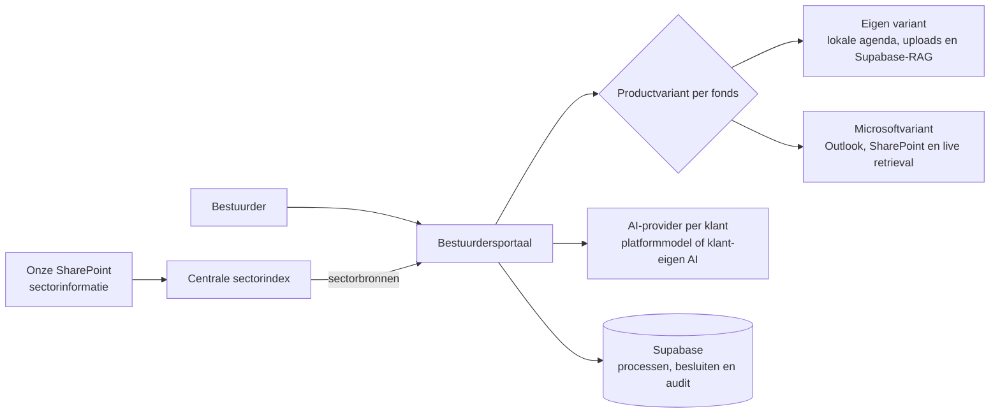
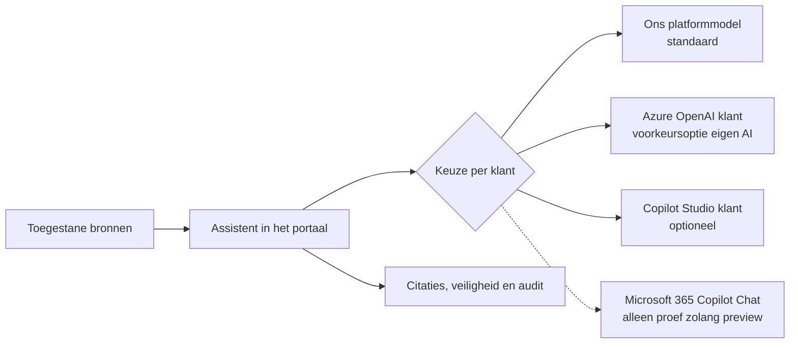
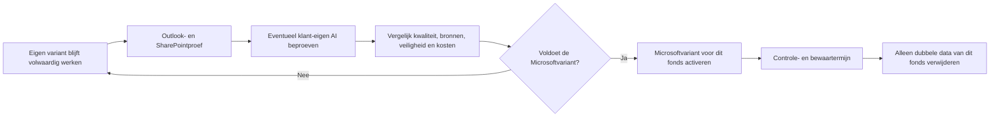

# 0208 — Twee productvarianten: eigen inrichting en Microsoft 365

- **Status:** Geaccepteerd als productrichting; Microsoftvariant na een geslaagde proef
- **Datum:** 2026-09-03
- **Aangevuld:** 2026-09-04 (duaal productmodel, klant-eigen AI en fase 0-pilotkader)
- **Betrokkenen:** Merlin (opdrachtgever/productowner), Codex (onderzoek en uitwerking)

## Besluit in het kort

> Het bestuurdersportaal biedt twee blijvend ondersteunde productvarianten. In de **eigen
> variant** beheert het portaal agenda, uploads en retrieval. In de **Microsoftvariant** blijven
> agenda en klantdocumenten in Outlook en SharePoint van de klant. Processen, besluiten en audit
> blijven in beide varianten in het portaal. De AI-provider is daarvan afzonderlijk instelbaar.

Het uitgangspunt is:

- **De klant kiest per fonds één productvariant: eigen of Microsoft.**
- **Binnen de Microsoftvariant is Outlook de bron voor wanneer, wie en waar.**
- **Binnen de Microsoftvariant is SharePoint de bron voor vergaderstukken.**
- **Het bestuurdersportaal is de bron voor voorbereiding, agendapunten, processen, besluiten en
  audit, in beide varianten.**
- **De AI-provider is per klant instelbaar, zonder een aparte versie van het portaal te bouwen.**

## Twee volwaardige productvarianten

## Fase 1-connectorgrens (2026-09-04)

De eerste koppeling gebruikt uitsluitend een single-tenant, delegated Microsoft Graph-profielproef.
De bestaande Supabase-login blijft leidend. Token-cache, OAuth-transacties en gezaghebbende
koppelstatus staan in een private database-schema achter een afzonderlijke, minimale
server-only database-rol; de bestaande service-roleclient wordt niet in tenant-routes gebruikt.
Alle fondsen blijven `eigen`; de Preview-pilotflag ontsluit alleen de koppeling en schakelt geen
bronlaag om.

| Onderdeel | Eigen variant | Microsoftvariant |
|---|---|---|
| Vergaderplanning | In het portaal, opgeslagen in Supabase | Outlook van de klant, read-only gesynchroniseerd |
| Klantdocumenten | Upload naar de beveiligde opslag van het portaal | SharePoint van de klant |
| Documentrechten | Portaalrollen en RLS | Microsoftrechten van de ingelogde gebruiker |
| Zoeken in klantdocumenten | Huidige Supabase-RAG | Live Microsoft-retrieval; Azure AI Search alleen als afgesproken alternatief |
| Sectorinformatie | Centrale platformbron | Dezelfde centrale platformbron |
| AI-provider | Platformmodel, tenzij anders geconfigureerd | Platformmodel of goedgekeurde klant-eigen AI-provider |
| Processen, besluiten en audit | Bestuurdersportaal/Supabase | Bestuurdersportaal/Supabase |

De productvariant gaat over de bronlaag van de klant. Onze centrale sectorbibliotheek mag intern
op onze SharePoint en Azure AI Search draaien zonder dat een klant zijn eigen Microsoftomgeving
hoeft te koppelen. De generatieve AI-provider is een afzonderlijke keuze en wordt niet stil uit
het productprofiel afgeleid.

Per fonds bestaat één leidend `integratieprofiel`: `eigen` of `microsoft`. Agenda-, document- en
retrievalproviders worden daaruit als één geteste bundel gekozen. We bieden niet iedere technisch
denkbare mix als productvariant aan. Een tijdelijke migratiestand mag beide bronnen vergelijken,
maar per vergadering en document blijft precies één bron leidend.

Met de Microsoftvariant willen we vier problemen tegelijk oplossen:

- bestuurders kunnen documenten in de browser bekijken;
- klanten hoeven documenten niet nogmaals naar het portaal te uploaden;
- we hoeven niet langer van ieder klantdocument een kopie, tekstfragmenten en embeddings in
  Supabase te bewaren;
- vergaderdatum, deelnemers, locatie en Teams-link hoeven niet apart in Outlook en het portaal te
  worden bijgehouden.

De eigen variant blijft een volwaardig product en is geen tijdelijke terugval. Bij activering van
de Microsoftvariant verwijderen we alleen eventuele dubbele klantdata van dat fonds, en pas nadat
de proef, controletermijn en bewaarbeoordeling zijn afgerond.

## Waarom dit besluit?

Een klant beheert zijn bestuursagenda meestal al in Outlook en zijn documenten in SharePoint. In
de huidige situatie moeten vergadergegevens opnieuw in het portaal worden ingevoerd en moet
hetzelfde document ook naar het bestuurdersportaal worden geüpload. Daarna doorloopt het document
bij ons een aparte keten voor opslag, beveiligingscontrole, tekstextractie, verdeling in fragmenten
en embeddings.

Dat heeft nadelen:

- er bestaan twee exemplaren van hetzelfde document;
- wijzigingen moeten opnieuw worden aangeleverd;
- Office-documenten worden gedownload in plaats van in de browser geopend;
- wij beheren een relatief zware documentverwerkingsketen;
- wij dragen de opslag- en embeddingkosten;
- SharePointrechten en portaalrechten moeten naast elkaar worden beheerd;
- wijzigingen en annuleringen in Outlook werken niet automatisch door in het portaal.

Door Microsoft 365 als tweede productvariant aan te bieden, kan een klant agenda en documenten op
de plaats houden waar hij die al beheert, terwijl een klant zonder deze wens de huidige inrichting
blijft gebruiken.

## De Microsoftinrichting

| Soort informatie | Waar staat het origineel? | Hoe wordt het gebruikt? |
|---|---|---|
| Vergaderdatum, deelnemers, locatie en Teams-link | Outlook van de klant | Via Microsoft Graph gesynchroniseerd |
| Documenten van een klant | SharePoint van die klant | Live via Microsoft, met de rechten van de gebruiker |
| Sector- en platformdocumenten | Onze SharePoint | Via één centrale zoekindex in Azure AI Search |
| Processen, besluiten en audit | Supabase | Rechtstreeks door het bestuurdersportaal |
| Tijdelijke migratiedocumenten buiten SharePoint | Bestaande uploadvoorziening | Alleen tijdens een gecontroleerde overgang |

### Architectuurplaat 1 — eenvoudig doelbeeld



De bestuurder ziet één portaal. Bij de Microsoftvariant worden achter de schermen drie Microsoft
365-bronnen gebruikt:

- Outlook van de klant voor de vergaderplanning;
- de eigen SharePoint van het fonds voor fondsspecifieke informatie;
- onze centrale sectorbibliotheek voor wetgeving, toezicht en sectorrichtlijnen.

Het portaal combineert de relevante passages voordat het antwoord wordt gemaakt.

## Wat blijft er in Supabase?

Supabase blijft de operationele database van het bestuurdersportaal. In de eigen variant bevat
Supabase ook het bestaande document- en retrievalmodel. In de Microsoftvariant blijven onder
andere:

- de portaalkoppeling van een Outlook-afspraak met een vergadering en agendapunten;
- procedures en dossiers;
- besluiten en stemmingen;
- gebruikers- en fondskoppelingen;
- instellingen en rechten van het portaal;
- gesprekken en auditgegevens;
- verwijzingen naar de gebruikte SharePointdocumenten;
- de minimale gegevens die nodig zijn om de Outlook-synchronisatie te volgen.

Voor een SharePointdocument bewaren we bijvoorbeeld het fonds, de titel, `siteId`, `driveId`,
`itemId`, versie, webadres en laatste controledatum. Daarmee kunnen we het document blijven vinden,
ook wanneer de bestandsnaam of map verandert.

Voor een Outlook-afspraak bewaren we de vaste event-ID, `iCalUId`, mailbox-/kalenderidentiteit,
synchronisatiestatus en de koppeling met de portaalvergadering. De actuele afspraak blijft in
Outlook; Supabase bevat alleen de operationele verwijzing en de portaalgegevens.

## Wat kan er uit Supabase verdwijnen?

Na activering van de Microsoftvariant hoeven we voor de klantdocumenten van dat fonds niet meer
permanent te bewaren:

- het originele bestand in Supabase Storage;
- de volledige geëxtraheerde tekst;
- alle documentfragmenten;
- de embeddings;
- de bijbehorende herindexeringsdata.

Per AI-antwoord bewaren we wel voldoende bewijs om later te kunnen uitleggen welke bronnen zijn
gebruikt. Dat bestaat minimaal uit documentidentiteit, versie, zoektijdstip en bronverwijzingen.
Als dat voor een betrouwbaar auditspoor noodzakelijk is, bewaren we ook de exact gebruikte kleine
tekstfragmenten. We bouwen daarmee geen tweede doorzoekbare documentbibliotheek op.

## Onze SharePoint-inrichting

Onze SharePoint krijgt één site met drie documentbibliotheken:

```text
Bestuurdersportaal Kennisbank
│
├── Sectorbibliotheek                 wordt doorzocht
│   ├── Algemeen
│   │   ├── Wet- en regelgeving
│   │   ├── Toezicht
│   │   ├── Sectorrichtlijnen
│   │   └── Onderzoek en kennis
│   │
│   └── Pensioenfondsen
│       ├── Wet- en regelgeving
│       ├── Toezicht
│       ├── Sectorrichtlijnen
│       └── Onderzoek en kennis
│
├── Curatie                           wordt niet doorzocht
│   ├── Te beoordelen
│   ├── In bewerking
│   └── In review
│
└── Beheer en bewijs                  wordt niet doorzocht
    ├── Bronregister
    ├── Gebruiksrechten en licenties
    ├── Curatiebeleid
    └── Evaluaties en testsets
```

Alleen gepubliceerde documenten uit de `Sectorbibliotheek` mogen als AI-bron worden gebruikt.
Werkdocumenten, licentie-informatie en testmateriaal blijven buiten de zoekindex.

### Mappen voor navigatie, metadata voor betekenis

De mappenstructuur blijft bewust ondiep. Belangrijke kenmerken worden als SharePointkolommen
vastgelegd:

| Veld | Voorbeeld |
|---|---|
| Sector | Pensioenfondsen |
| Bronorganisatie | DNB, AFM, Overheid, Pensioenfederatie |
| Broncategorie | Wetgeving, toezicht, sectorrichtlijn of kennis |
| Documenttype | Beleid, advies, analyse, besluit of overig |
| Publicatiestatus | Concept, review, gepubliceerd of ingetrokken |
| Bronstatus | Actief, historisch of uitgesloten |
| Normgewicht | Bindend, toezichtverwachting, sector-guidance of informatief |
| Geldigheid | Documentdatum, geldig vanaf en geldig tot |
| Beheer | Eigenaar, versie en volgende reviewdatum |

Er komt geen fysieke map `Archief`. Een document wordt historisch gemaakt met status en
geldigheidsdatum. Daardoor blijven de vaste documentidentiteit en koppelingen behouden.

## SharePoint bij de klant

We sluiten bij voorkeur aan op een bestaande documentbibliotheek van de klant. De klant hoeft zijn
hele omgeving niet voor ons te reorganiseren. De beheerder wijst alleen aan welke site,
bibliotheek of map bij het bestuurdersportaal hoort.

Wanneer een klant nog geen geschikte structuur heeft, kunnen we dit eenvoudige sjabloon aanbieden:

```text
Bestuursdocumenten
├── Beleid en kaders
├── Vergaderingen
├── Besluitdossiers
├── Rapportages en verantwoording
└── Organisatie en governance
```

De koppeling met een vergadering, agendapunt of dossier leggen we in het portaal of in metadata
vast. We proberen deze betekenis niet alleen uit mapnamen af te leiden.

## Outlook bij de klant

Per klant koppelen we bij voorkeur één aangewezen bestuursagenda, bijvoorbeeld de agenda van een
gedeelde mailbox zoals `bestuursagenda@klant.nl`. Dat geeft één herkenbare bron en voorkomt dat het
portaal alle persoonlijke agenda's van bestuurders moet uitlezen.

Outlook levert:

- onderwerp, datum en tijd;
- organisator en deelnemers;
- locatie en Teams-link;
- terugkerende afspraken, wijzigingen en annuleringen.

Het bestuurdersportaal vult dit aan met de formele agendapunten, BOB-fase, voorbereiding,
proceskoppelingen, besluiten en audit. Een Outlook-afspraak wordt dus geen procesdossier.

De verbinding ziet er zo uit:

```text
Outlook-afspraak
       ↕
Vergadering in het bestuurdersportaal
       ↕
SharePoint-map met vergaderstukken
```

De koppeling tussen vergadering en SharePoint-map wordt in het portaal opgeslagen. Een link in de
tekst van de Outlook-afspraak mag als gebruiksgemak, maar is niet de enige technische koppeling.

We beginnen met leestoegang. Outlook blijft leidend en het portaal volgt wijzigingen via Microsoft
Graph. Schrijven vanuit het portaal naar Outlook is een eventuele latere fase. Voor automatische
synchronisatie zonder ingelogde gebruiker moet de applicatietoegang bij de klant worden beperkt tot
de aangewezen bestuursmailbox.

## Hoe zoeken en antwoorden werkt

1. Outlook levert de actuele vergadering en het portaal bepaalt de gekoppelde vergadercontext.
2. De bestuurder stelt een vraag in het portaal.
3. Microsoft zoekt live in de toegestane SharePointdocumenten van de klant.
4. Het portaal zoekt daarnaast in onze gepubliceerde sectorbibliotheek.
5. Het portaal controleert fonds, vergadering, sector, status en geldigheid en combineert de
   resultaten.
6. Alleen de geselecteerde passages gaan naar het generatiemodel.
7. Het antwoord bevat links naar de gebruikte documenten.
8. Supabase bewaart een beperkt auditrecord van de gebruikte bronnen.

Bij het openen van een document vraagt het portaal Microsoft om een kortlevende preview. Word-,
Excel-, PowerPoint- en PDF-documenten kunnen daardoor in de browser worden bekeken zonder een
permanente kopie in het portaal.

## AI-provider per klant

De assistent wordt provider-onafhankelijk ingericht. Het bestuurdersportaal gebruikt overal
dezelfde ingang en dezelfde eisen aan brongebruik, citaties, veiligheid en audit. Per klant bepalen
we welke AI-provider het antwoord maakt.

| Variant | Wanneer passend? | Beleid |
|---|---|---|
| Ons platformmodel | Standaarddienst zonder eigen AI-inrichting bij de klant | Standaard |
| Azure OpenAI van de klant | Klant wil eigen Azure, kosten en modelbeheer, maar wel onze volledige assistentwerking | Voorkeursoptie voor klant-eigen AI |
| Copilot Studio-agent van de klant | Klant beheert al een eigen agent, instructies en acties | Optionele klantvariant |
| Microsoft 365 Copilot Chat API | Klant wil zijn eigen Microsoft 365 Copilot direct in het portaal gebruiken | Alleen proef zolang de API preview is |

De technische koppeling krijgt één gemeenschappelijk contract:

```text
Het portaal levert
├── de vraag
├── fonds-, vergadering- en gebruikerscontext
├── de toegestane bronpassages
├── de gewenste antwoordmodus
└── een audit-ID

De gekozen AI-provider levert
├── het antwoord
├── bronverwijzingen
├── gebruiks- en providermetadata
└── een eventuele veiligheidsstatus
```

Onze bestuurlijke logica blijft dus van het portaal. Daaronder vallen onder meer bronafbakening,
status- en geldigheidsfilters, antwoordmodi, citatiecontrole en het auditspoor. Een klant-eigen
provider mag deze waarborgen niet stilzwijgend omzeilen.

### Architectuurplaat 2 — één assistent, keuze per klant



De gebruiker werkt in alle varianten met dezelfde assistent in het portaal. Alleen de voorziening
die het antwoord genereert verschilt; de selectie van toegestane bronnen en het auditspoor blijven
onder controle van het portaal.

### Microsoft 365 Copilot van de klant

De Microsoft 365 Copilot Chat API kan namens de ingelogde gebruiker een gesprek met Copilot voeren
en antwoorden in het bestuurdersportaal teruggeven. SharePointbestanden kunnen als context worden
meegestuurd. Relevante fragmenten uit onze sectorindex moeten we afzonderlijk als toegestane
context toevoegen, omdat onze SharePoint niet automatisch onderdeel is van de Microsoft-tenant van
de klant.

Deze variant gaat nog niet rechtstreeks naar productie. Op het moment van dit besluit:

- is de Chat API nog preview;
- heeft iedere gebruiker een Microsoft 365 Copilot-add-on nodig;
- werkt de API alleen namens een ingelogde gebruiker en niet met application permissions;
- vraagt de API ruime gedelegeerde toegang tot Microsoft 365-bronnen;
- gebruikt Copilot enterprise-grounding en standaard ook webgronding;
- ondersteunt de API tekstuele antwoorden, maar geen acties zoals afspraken of bestanden maken.

Daarom wordt in een proef vastgesteld of de klant de rechten accepteert en of antwoorden werkelijk
binnen de door het portaal gekozen bronset blijven. Webgronding wordt per vraag uitgezet wanneer die
niet expliciet is toegestaan.

### Copilot Studio of Azure OpenAI van de klant

Een bestaande Copilot Studio-agent kan via het custom-appkanaal aan het portaal worden gekoppeld.
De klant beheert dan zelf de agent, kennis, instructies, licenties en Power Platform-regels. Dat kan
functioneel afwijken van onze standaardassistent en krijgt daarom een afzonderlijke acceptatietest.

Als de klant vooral zijn eigen AI-resource en factuur wil gebruiken, heeft een klant-eigen Azure
OpenAI-resource de voorkeur. Onze assistentlogica blijft dan intact en alleen het modelendpoint
verschilt per klant.

### Configuratie en audit

Supabase bewaart per fonds het integratieprofiel, de afzonderlijke AI-providerkeuze en niet-geheime
configuratiereferenties, zoals Microsoft-tenant, agent- of resource-ID en activeringsstatus.
Toegangssleutels en tokens worden niet als gewone databasevelden opgeslagen. Een wijziging van het
integratieprofiel is een beheerhandeling met reden, versie en append-only audit.

Per antwoord blijft het portaal minimaal provider, gebruikte bronset, documentversies,
gespreksreferentie, tijdstip en antwoord-/audit-ID vastleggen. Wanneer Microsoft of de klant-agent
zelf ook gesprekken bewaart, moeten bewaartermijnen, inzagerechten en verwijdering tussen beide
omgevingen op elkaar worden afgestemd.

## Kostenverdeling

Kosten verschuiven niet vanzelf door een SharePointkoppeling. Ze volgen de eigenaar van de
licentie of cloudvoorziening.

| Onderdeel | Beoogde betaler |
|---|---|
| Outlook/Exchange Online van de klant | Klant, via Microsoft 365 |
| SharePoint van de klant | Klant, via Microsoft 365 |
| Live retrieval van klantdocumenten | Klant, via Copilot-licentie of eigen Azure-billing policy |
| Onze SharePoint en centrale sectorindex | Wij, gedeeld over klanten |
| Supabase, hosting en monitoring | Wij, zolang deze onder onze accounts draaien |
| Ons standaard generatiemodel | Wij, verwerkt in onze dienstverlening |
| Azure OpenAI van de klant | Klant, via de eigen Azure-resource |
| Copilot Studio of Microsoft 365 Copilot van de klant | Klant, via de eigen Microsoft-licenties en eventuele verbruikskosten |
| Koppeling, bronselectie, citatiecontrole en audit | Wij, als onderdeel van het portaal |

Deze verdeling wordt per klant tijdens de onboarding vastgelegd. Alleen het verbinden met
SharePoint of het kiezen van Copilot verplaatst dus niet automatisch alle kosten naar de klant.
De kosten van de voorziening die onder het Microsoft-contract van de klant draait, vallen daar in
beginsel wel. Onze portaal-, integratie- en beheerkosten blijven onderdeel van onze dienstverlening.

## Gefaseerde invoering

Fase 0 is uitgewerkt in
[`MICROSOFT-365-PILOT-FASE-0.md`](../MICROSOFT-365-PILOT-FASE-0.md). Daarin staan de afbakening,
doelarchitectuur, gegevensgrenzen, testinrichting, de criteria MS-01 tot en met MS-12 en drie
criteria voor het blijvend duale model.
De eerste pilot gebruikt onze eigen Microsoft 365-omgeving en synthetische of niet-vertrouwelijke
testinhoud. In deze fase wordt nog geen productiecode of klanttenant gewijzigd.

De implementatie volgt daarna deze roadmap:

1. Microsoft-fundament en veilige accountkoppeling;
2. Outlook read-only en, parallel daaraan, de centrale AI-gateway;
3. SharePointdocumenten tonen en previewen;
4. één gemeenschappelijk retrieval-contract;
5. live Microsoft-retrieval vergelijken met de huidige RAG;
6. optioneel klant-eigen AI-providers aansluiten;
7. één klantpilot en daarna gecontroleerde activering van de gekozen productvariant.

### Stap 1 — Outlook en SharePoint koppelen

We koppelen één testagenda en één testlocatie in SharePoint. Vergaderingen worden read-only uit
Outlook getoond en documenten worden via Microsoft in de browser geopend. De bestaande agenda-,
upload- en zoekvoorziening blijft werken.

### Stap 2 — zoeken vergelijken

We controleren eerst de Outlook-synchronisatie op wijzigingen, annuleringen, terugkerende
afspraken, tijdzones en dubbele afspraken. Daarnaast laten we Microsoft-retrieval en de huidige
Supabase-RAG dezelfde testvragen beantwoorden. We vergelijken kwaliteit, snelheid,
bronverwijzingen, rechten en kosten. Excel, tabellen, gewijzigde versies en ingetrokken rechten
krijgen hierbij bijzondere aandacht.

### Stap 3 — klant-eigen AI beproeven, indien gewenst

Wanneer een klant een eigen AI-provider wil gebruiken, voeren we met dezelfde vragen en bronnen
een afzonderlijke proef uit. We vergelijken antwoordkwaliteit, bronverwijzingen, rechten,
veiligheidsfilters, snelheid, auditgegevens en kosten met ons platformmodel. Een klant-eigen
provider wordt pas geactiveerd nadat de klant de licenties, tenanttoestemming en verwerking heeft
goedgekeurd.

### Stap 4 — Microsoftvariant activeren per klant

Als de proef slaagt, activeren we voor dat fonds gecontroleerd de Microsoftvariant. Nieuwe
SharePointdocumenten worden dan niet meer naar Supabase gekopieerd of daar van embeddings
voorzien. Andere fondsen blijven de eigen variant ongewijzigd gebruiken.

### Stap 5 — oude opslag opruimen

Pas na een afgesproken controle- en bewaartermijn verwijderen we bij dat Microsoftfonds eventuele
dubbele bestanden, fragmenten en embeddings. De noodzakelijke auditgegevens blijven bestaan. De
opslag en embeddings van fondsen in de eigen variant worden niet opgeruimd.

### Architectuurplaat 3 — veilige overgang



## Voorwaarden voor ingebruikname

De Microsoftvariant gaat voor een klant pas in productie wanneer:

- zoeken en bronverwijzingen minstens gelijkwaardig zijn aan de huidige oplossing;
- Outlookwijzigingen, annuleringen en terugkerende afspraken correct en tijdig worden verwerkt;
- de agenda-koppeling is beperkt tot de afgesproken bestuursmailbox of kalender;
- de Microsoftrechten van de gebruiker bij iedere vraag en preview worden gerespecteerd;
- documenten van verschillende klanten nooit door elkaar kunnen raken;
- de gekozen AI-provider uitsluitend de door het portaal toegestane context gebruikt;
- citaties, veiligheidscontroles en audit bij iedere ondersteunde provider gelijkwaardig zijn;
- de exacte documentversie achter een AI-antwoord aantoonbaar is;
- PDF, Word, PowerPoint en Excel voldoende worden ondersteund;
- privacy, retentie, licenties, tenanttoestemming en kosten schriftelijk zijn vastgelegd;
- ongewenste web- of Microsoft 365-gronding aantoonbaar is uitgeschakeld of afgebakend;
- vooraf is bepaald wat het portaal doet wanneer de gekozen AI-provider niet beschikbaar is;
- uitval van Microsoft beheerst kan worden opgevangen.

Wanneer live Microsoft-retrieval niet voldoet, gebruiken we voor klantdocumenten een eigen
Azure AI Search-index in de omgeving van de klant. De documenten blijven dan nog steeds uit
Supabase, maar de klant heeft wel een aparte zoekindex.

## Belangrijke aandachtspunten

- De remote Microsoft Retrieval API is bij dit besluit nog een previewdienst. Voor
  productiegebruik is daarom een expliciete risicoafweging nodig.
- Ook de Microsoft 365 Copilot Chat API is nog preview. Deze variant blijft daarom een proef en is
  geen verplichte productiekeuze.
- De Copilot Chat API werkt alleen met gedelegeerde gebruikerstoegang, vraagt meerdere ruime
  Microsoft 365-permissies en vereist per gebruiker een geschikte Copilot-licentie. De klant moet
  dit bewust accepteren.
- Een Copilot Studio-agent kan andere instructies, acties en veiligheidsregels hebben dan onze
  standaardassistent. Iedere klant-agent krijgt daarom een eigen functionele en veiligheidstest.
- Voor Outlook beginnen we read-only. Achtergrondsynchronisatie vraagt applicatietoegang die bij
  de klant expliciet tot de aangewezen mailbox moet worden beperkt.
- Privéafspraken en niet-noodzakelijke gegevens uit onderwerp, tekst of deelnemerslijst worden niet
  in het portaal overgenomen.
- Live zoeken is altijd actueel, maar een gewijzigd document kan een later antwoord veranderen.
  Daarom slaan we documentversie en bronbewijs op.
- Onze sectorindex moet vóór het zoeken op sector, publicatiestatus en geldigheid filteren. Alleen
  achteraf ongewenste resultaten verwijderen is niet voldoende.
- De geselecteerde tekstpassages gaan nog steeds naar het generatiemodel. Het verdwijnen van
  embeddings lost dus niet automatisch alle privacy- en verwerkersvragen op.

## Wat dit besluit niet omvat

Dit besluit betekent nog niet dat:

- Supabase volledig wordt vervangen;
- de eigen productvariant wordt uitgefaseerd;
- agenda-, document- en retrievalproviders willekeurig combineerbaar worden;
- ons platformmodel voor alle klanten door Microsoft AI wordt vervangen;
- iedere klant een eigen volledige Azure-omgeving moet krijgen;
- de previewversie van de Microsoft 365 Copilot Chat API al productierijp wordt verklaard;
- een klant-Copilot onbeperkt alle Microsoft 365-informatie mag gebruiken;
- het portaal zonder afspraak automatisch tussen AI-providers wisselt;
- het portaal direct afspraken in Outlook mag aanmaken of wijzigen;
- de bestaande uploadvoorziening onmiddellijk verdwijnt;
- bestaande documenten zonder controle worden verwijderd.

## Referenties

- [Microsoft Graph — werken met agenda's en afspraken](https://learn.microsoft.com/en-us/graph/api/resources/calendar-overview?view=graph-rest-1.0)
- [Microsoft Graph — afspraken incrementeel synchroniseren](https://learn.microsoft.com/en-us/graph/api/event-delta?view=graph-rest-1.0)
- [Microsoft Graph — vaste Outlook-identifiers](https://learn.microsoft.com/en-us/graph/outlook-immutable-id)
- [Microsoft Graph — agenda-permissies](https://learn.microsoft.com/en-us/graph/permissions-reference#calendarsread)
- [Microsoft Graph — documentpreview](https://learn.microsoft.com/en-us/graph/api/driveitem-preview?view=graph-rest-1.0)
- [Microsoft 365 Copilot Retrieval API](https://learn.microsoft.com/en-us/microsoft-365/copilot/extensibility/api/ai-services/retrieval/overview)
- [Microsoft 365 Copilot Chat API — overzicht](https://learn.microsoft.com/en-nz/microsoft-365/copilot/extensibility/api/ai-services/chat/overview)
- [Microsoft 365 Copilot Chat API — endpoint en permissies](https://learn.microsoft.com/en-us/microsoft-365/copilot/extensibility/api/ai-services/chat/copilotconversation-chat)
- [Microsoft 365 Copilot Chat API — bestanden en aanvullende context](https://learn.microsoft.com/en-us/microsoft-365/copilot/extensibility/api/ai-services/chat/resources/copilotcontextualresources)
- [Copilot Studio-agent verbinden met een eigen applicatie](https://learn.microsoft.com/en-us/microsoft-copilot-studio/publication-connect-bot-to-custom-application)
- [Privacy en bescherming bij Microsoft 365 Copilot](https://learn.microsoft.com/en-us/copilot/privacy-and-protections)
- [Remote SharePoint als kennisbron](https://learn.microsoft.com/en-us/azure/search/agentic-knowledge-source-how-to-sharepoint-remote)
- [SharePoint indexeren met Azure AI Search](https://learn.microsoft.com/en-us/azure/search/search-how-to-index-sharepoint-online)
- [Retrieval API pay-as-you-go](https://learn.microsoft.com/en-us/microsoft-365/copilot/extensibility/api/ai-services/retrieval/paygo-retrieval)
- Bestaande keuzes over RAG: [`0025`](./0025-rag-structuur-contextueel-reindex.md),
  [`0045`](./0045-t4-retrieval-fondsfilter-namespace.md),
  [`0139`](./0139-reproduceerbare-retrieval-determinisme.md) en
  [`0172`](./0172-primaire-documentmodus-en-vindbaarheid-conceptstukken.md).
- Bestaande keuzes over opslag en beveiliging: [`0022`](./0022-increment-P1-generieke-curatie-keuzes.md),
  [`0024`](./0024-hard-delete-generiek-document-audit-overleeft.md) en
  [`0181`](./0181-wp3-clamav-containerproject-arn1.md).
- Bestaand metadatamodel:
  [`../../Documentcuratie (tooling en bronnen)/metadata-en-classificatie.md`](../../Documentcuratie%20(tooling%20en%20bronnen)/metadata-en-classificatie.md).
- Microsoft-doelbeeld:
  [`../../naslagwerk/2026-09-01/technische-inrichting.md`](../../naslagwerk/2026-09-01/technische-inrichting.md).
